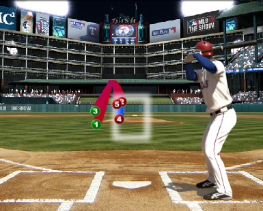

% pitchRx: Tools for Collecting and Analyzing Major League Baseball's PITCHf/x Data
% Carson Sievert
% 3/29/2013

## Biography

* B.A. in Math & Econ from Saint John's University (MN)
* Data Analyst at a College Enrollment & Financial Aid Consulting Firm
* Second Year Statistics Graduate Student at ISU
* Soon to be Summer Intern at AT&T (mentors: Kenny Shirley & Chris Volinsky)
* PhD Interest: web based statistical graphics

## Outline

1. What is PITCHf/x?
  * Camera based motion tracking system placed in every MLB stadium
  * Tracks every baseball thrown by a pitcher to home plate
  * PITCHf/x parameters that explain the ball's path
2. PITCHf/x data format & structure
  * XML formatting
  * Hierarchal layout
  * Issues with data collection
  
## Outline continued
  
3. Visualizing PITCHf/x
  * 2D Animation for comparing pitcher tendencies
  * 3D interactive graphics for a closer look
  * Strikezone plots to evaluate umpire bias towards the home team

## Problem Statement

1. Existing methods for collecting PITCHf/x require running Perl scripts and other Web stack technologies. This presents hurdles that prevent many people from obtaining the data. Furthermore, these scripts are very hard to customize or extend.

2. There is no automated process for creating popular PITCHf/x visuals. Furthermore, most are restricted to static 2D plots of PITCHf/x data, even though this data can be used to create three-dimensional flight paths dependent upon time.

## The Solution: `pitchRx`

* Available on CRAN and github.

1. Easily collect PITCHf/x and related information from the web source.
  * Simplifies parsing of many XML files into data frame(s). `pitchRx` has functionality for general XML scraping, but I will focus on PITCHf/x.
  
2. Provides an automated process for producing strikezone plots (bivariate scatterplot densities), 2D animation of pitch locations over time, and 3D interactive graphics.

## pat1


## pat2


## PITCHf/x parameters

* A best fitting curve is fit to the following equations of motion:

1. $x(t) = x0 + vx0*t + ax*t^2$
2. $y(t) = y0 + vy0*t + ay*t^2$
3. $z(t) = z0 + vz0*t + az*t^2$

* The fitted coefficients are saved as: $x0, y0, z0, vx0, vy0, vz0, ax, ay, az$
* With this equation, the 3D location of the pitch can recreated for any time point.

## game



## PITCHf/x data format


## XML Hierarchy


## Data Issues & Solutions

1. Information across different tags are inconsistent.
 * `pitchRx` fills NAs where appropriate
2. Players are identified by ID.
 * `pitchRx` creates columns to identify the pitcher and batter by name.
3. Source data doesn't explicitly record things like the pitch count.
 * `pitchRx` derives such columns to help compliment an analysis.

## Scraping made easy


```r
library(pitchRx)
data <- scrapeFX(start="2011-01-01",
                end="2011-12-31",
            tables=list(atbat=NULL, pitch=NULL))
```


* This function call scrapes all 2011 information at the atbat and pitch level into two data frames: `data$atbat` and `data$pitch`.

* By setting the value of each tables element to `NULL`, `scrapeFX` finds the most complete set of fields (and fills `NA` appropriately).

* One can pass a character vector, for example `c("x0", "y0", "z0")`, for the value and this will set the "master" list of fields.

## Scraping PITCHf/x and related data


```r
data <- scrapeFX(tables=list(coach=NULL,
          runner=NULL, umpire=NULL,
          atbat=fields$atbat, 
          pitch=fields$pitch, 
          player=fields$player,  
          game=fields$game))
```


* Useful for examining differences in umpire strikezones, for instance.

## Mariano Rivera and Phil Hughes fastballs from 2011.


```r
atbats <- subset(data$atbat, pitcher_name %in% 
                c("Mariano Rivera", "Phil Hughes"))
pitchFX <- join(atbats, data$pitch, 
                by=c("num", "url"), type="inner")
pitches <- subset(pitchFX, pitch_type %in% 
                  c("FF", "FC"))
```


* I will use `pitches` to demonstrate the animation features of `pitchRx`


## Animation and batter stance

* By default, `pitchRx` calculates two aggregated strikezones. One for left handed batters and one for right handed batters.

* For this reason, it usually makes sense to facet plots by batter stance.

* The next slide is output from:


```r
animateFX(pitches, layer=list(theme_bw(),
                    coord_equal(),
                    facet_grid(.~stand, 
                      labeller = label_both)))
```


* Note that as the animation progresses, the pitches are being thrown directly towards you.

## `pitches` by stance (real time)

<div align = "left">
 <embed width="864" height="720" name="plugin" src="figure/ani.swf" type="application/x-shockwave-flash"> 
</div>


## And pitcher

<div align = "left">
 <embed width="864" height="720" name="plugin" src="figure/ani3.swf" type="application/x-shockwave-flash"> 
</div>


## Slower

<div align = "left">
 <embed width="864" height="720" name="plugin" src="figure/ani4.swf" type="application/x-shockwave-flash"> 
</div>


## WebGL Graphics


```r
Rivera <- subset(pitches, pitcher_name==
                   "Mariano Rivera")
interactiveFX(Rivera)
```


* Output can be viewed here:

[http://cpsievert.github.com/pitchRx/rgl1](http://cpsievert.github.com/pitchRx/rgl1)


## Shiny Demo

* Great for creating strikezone density plots (horizontal and vertical location as they crossed home plate).

* Encompasses all the bells and whistles of the `pitchRx::strikeFX`.

* You can run the local version by:


```r
library(shiny)
runGitHub('pitchRx', 'cpsievert', 
          subdir='inst/shiny')
```


* Or the version hosted by glimmer:

[http://glimmer.rstudio.com/cpsievert/pitchRx](http://glimmer.rstudio.com/cpsievert/pitchRx)


## Biased umpires?

* In many sports, people like to speculate whether umpires make decisions in favor of the home team.

* With PITCHf/x, we can examine evidence of 'strikezone bias'.

<div align="center"></div>

## Every called strike!

<div align="center"></div>

## Home vs Away Called Strikes

<div align="center"></div>

## Home vs Away Balls

<div align="center"></div>

## My Conributions

1. R package pitchRx:
 * Easily collect PITCHf/x data directly from the `R` console.
 * Simplifies general XML parsing into data frames.
 * Provides a framework (and shortcuts) for PITCHf/x visualizations

2. [pitchRx demo page](http://cpsievert.github.com/pitchRx/demo/)

3. Web application (on top of `pitchRx`) that helps engage the code illiterate

4. Paper currently under review for the `R` Journal

## Special Thanks to:

#### This project wouldn't be possible without the help of these people/organizations. Thank you for your help and/or great work!!!

* Heike Hofmann (my major professor) [@heike_hh](https://twitter.com/heike_hh)
* Di Cook [@visnut](https://twitter.com/visnut/)
* Yihui Xie [@xieyihui](https://twitter.com/xieyihui)
* Ramnath Vaidyanathan [@ramnath_vaidya](https://twitter.com/ramnath_vaidya)
* RStudio [@rstudioapp](https://twitter.com/rstudioapp)
* Hadley Wickham [@hadleywickham](https://twitter.com/hadleywickham)
* Joe Cheng [@jcheng](https://twitter.com/jcheng)
* Winston Chang [@winston_chang](https://twitter.com/winston_chang)
* MLB Advanced Media [@mlbdotcom](https://twitter.com/mlbdotcom)
* Alan Nathan [@pobguy](https://twitter.com/pobguy)
* Mike Fast [@fastballs](https://twitter.com/fastballs)

## Questions???
