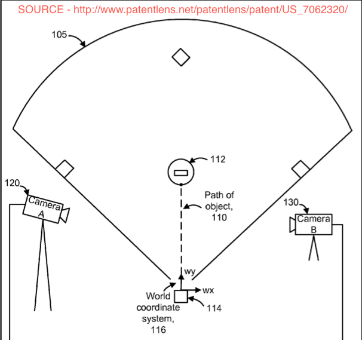
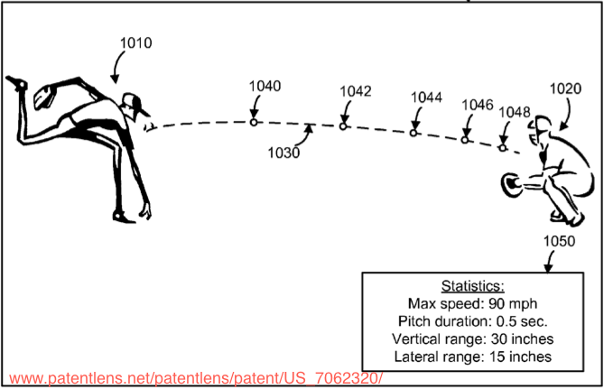
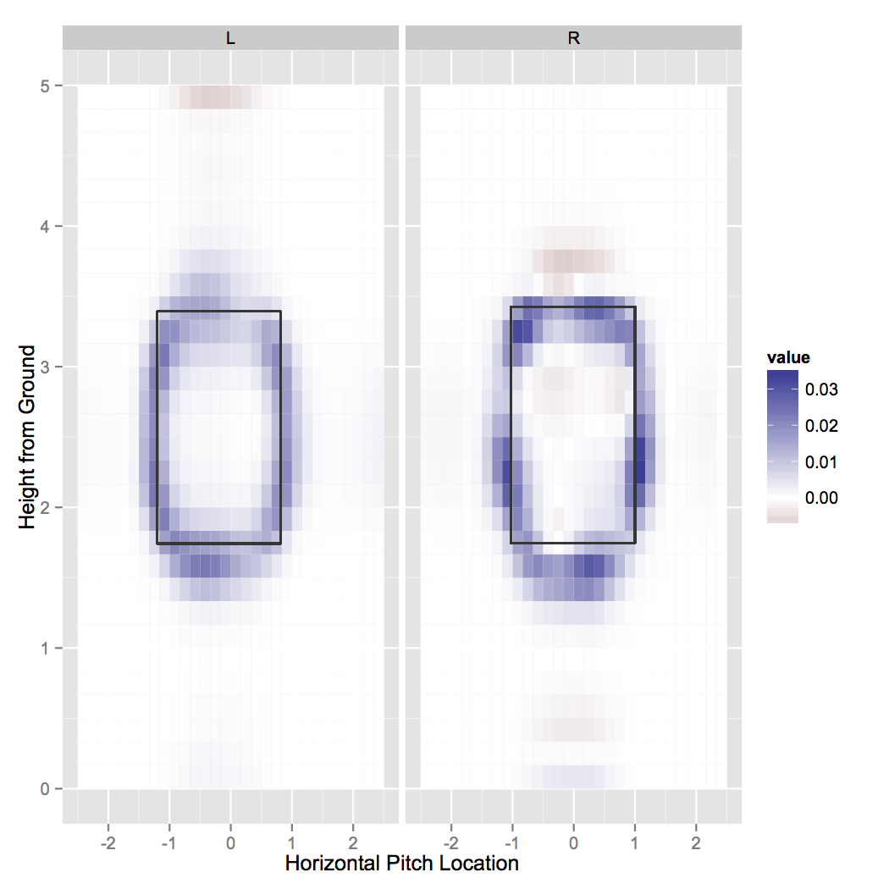
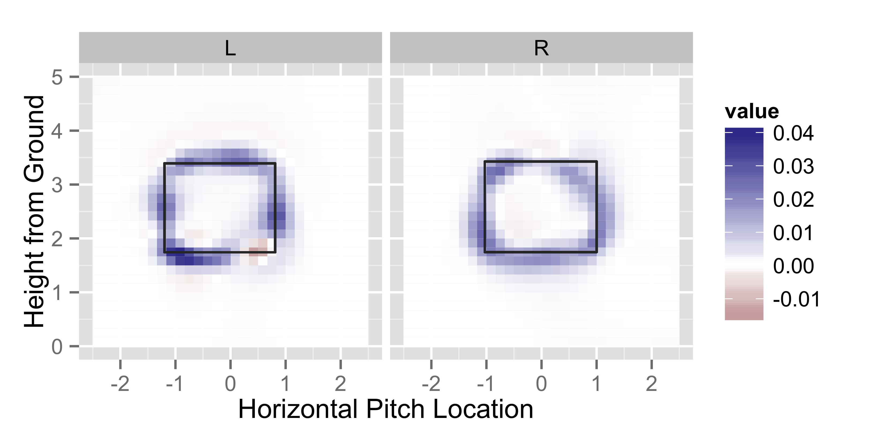

% pitchRx: Tools for Collecting and Analyzing MLB PITCHf/x Data
% Carson Sievert 8/6/2013
% Follow along: [http://cpsievert.github.io/slides/pitchRx/jsm](http://cpsievert.github.io/slides/pitchRx/jsm)


## Outline

1. What is PITCHf/x?
  * Camera based motion tracking system placed in every MLB stadium
  * Tracks every baseball thrown by a pitcher to home plate 
2. Collecting PITCHf/x with `pitchRx`
3. Visualizing PITCHf/x with `pitchRx`
  * Probabilistic strike-zones
  * 2D Animation of pitch trajectories 
  * 3D interactive graphics for a closer look
  


  
## Remove Me!



## Remove Me!


  
## Scraping PITCHf/x

1. All PITCHf/x data is freely accessible here: [http://gd2.mlb.com/components/game/mlb/](http://gd2.mlb.com/components/game/mlb/)
2. Common methods for collecting PITCHf/x are laborious
  * Requires a web stack (ie, Linux, Apache, MySQL, PHP, Perl)
  * These methods are not easily extended to related data sources.
3. WE CAN DO BETTER!!!

## Scraping with `pitchRx`


```r
library(pitchRx)
dat <- scrapeFX(start="2008-01-01", 
                end="2013-01-01")
atbats <- dat$atbat
pitches <- dat$pitch
```


<div align="center"></div>

## Advanced Scraping

* scrapeFX can return up to seven different data frames


```r
dat <- scrapeFX(start="2008-01-01", 
                end="2013-01-01"
                tables = list(atbat = NULL, 
                              pitch = NULL,
  	                          coach = NULL, 
                              runner = NULL, 
                              umpire = NULL, 
                              player = NULL, 
                              game = NULL))
```

  
* The function `urlsToDataFrame` can be used to manipulate _any_ collection of XML files into a list of data frames.

## Strike-zone plots

1. Strike-zone plots have height of the batter on the vertical axis and data points correspond to the location of baseballs as they cross home plate.
2. `pitchRx` can easily produce two types of strikezone plots:
  * frequencies
  * probabilities of events (more interesting in most cases)
3. Useful for answering questions such as: "Do umpires favor home (as opposed to away) pitchers?"
  * More specifically: "Given the umpire has to make a decision, do home pitchers have a higher chance of receiving a called strike?""

## Some terminology

* A __called strike__ is a case where the batter does not swing and the umpire declares the pitch a strike (which is a favorable outcome for the pitcher). 

* A __ball__ is an instance where the batter doesn't swing and the umpire declares the pitch a ball (which is a favorable outcome for the batter). 

* By restricting ourselves to these two outcomes, we condition upon a situation where the umpire has to make a binary decision about the pitch.


## Probability of a Called Strike

* Here we use `gam` from the `mgcv` package to visualize the probability of a called strike (given the ump has to make a decision).


```r
pitchFX <- plyr::join(dat$pitch, dat$atbat, 
                by=c("num", "url"))
decisions <- subset(pitchFX, des %in% 
                    c("Called Strike", "Ball"))
decisions$strike <- as.numeric(decisions$des == 
                                 "Called Strike")
strikeFX(decisions, model=gam(strike~s(px)+s(pz), 
          family = binomial(link='logit')), 
          layer=facet_grid(.~stand))
```


## Remove Me!


## Difference in probability of Called Strike

* We can also visualize the __difference__ in probabilistic events by adding arguments to `density1` and `density2`.

* Here we find the probability of a called strike during the top inning minus the probability of a called strike during the bottom inning (top inning == home pitcher).


```r
strikeFX(decisions, model=gam(strike~s(px)+s(pz), 
          family = binomial(link='logit')), 
          density1=list(top_inning="Y"), 
          density2=list(top_inning="N"), 
          layer=facet_grid(.~stand))
```


## Remove Me!



## Remove Me!



## Home Field Advantage

* It appears away teams actually have something valid to complain about...

<div align="center"></div>

## Strike-zones vs Trajectories

* `strikeFX` is nice for visualizing _a lot_ of data (we just visualized over 1.5 million pitches).

* PITCHf/x can also be used to regenerate (approximate) pitch trajectories.

* It isn't straightforward to animate millions of pitch trajectories, so we usually restrict our focus to a few cases.

## Yu "Vishnu" Darvish - a case study

<div align="center">
  
</div>

*Created by Drew Sheppard [@DShep25](https://twitter.com/DShep25)

## Get the data


```r
dat <- scrapeFX(start="2013-04-24", 
                end="2013-04-24")
atbats <- subset(dat$atbat, 
                 pitcher_name == "Yu Darvish")
Darvish <- plyr::join(atbats, dat$pitch, 
                by=c("num", "url"), type="inner")
```


* `Darvish` contains info on every pitch thrown by Yu Darvish on April 24th, 2013.

## PITCHf/x animation

* `animateFX` can be used in a similar fashion to `strikeFX` for producing a series of plots that track pitch locations over time.

* As the `animateFX` animations progress, the pitches are being thrown directly towards you.


```r
animateFX(Darvish, layer=list(theme_bw(),
                    coord_equal(),
                    facet_grid(.~stand)))
```


## Real time animation

<div align = "left">
 <embed width="864" height="720" name="plugin" src="figure/ani.swf" type="application/x-shockwave-flash"> 
</div>


## Whoa, nelly!!!

<div align="center">
  
</div>

* Real time animations are __hard to digest__!

* Plotting that many pitches makes it even worse...

## "Normalized" PITCHf/x

* Let's average over pitch type (to get a 'typical' flight path)


```r
animateFX(Darvish, avg.by="pitch_types", 
          layer=list(coord_equal(),
          theme_bw(),
          facet_grid(.~stand)))
```


## 'Normalized' animation

<div align = "left">
 <embed width="864" height="720" name="plugin" src="figure/ani-norm.swf" type="application/x-shockwave-flash"> 
</div>


## [WebGL Graphics](http://cpsievert.github.io/pitchRx/YuDarvishNorm/)


```r
RH <- subset(Darvish, stand=="R")
interactiveFX(RH, avg.by="pitch_types")
```


<div align="center">
  
</div>

## Want more??

1. Visit the pitchRx [demo page](http://cpsievert.github.com/pitchRx/demo/) (now included with CRAN package as R Markdown vignette).
2. R Journal article coming soon!
3. [My web app](http://glimmer.rstudio.com/cpsievert/pitchRx/).
  * Slick user interface to `strikeFX` and `animateFX`
  * Upload your own csv files!
4. Contribute to development or post an issue on [GitHub](https://github.com/cpsievert/pitchRx).
5. I [occasionally](http://cpsievert.wordpress.com/) [blog](http://cpsievert.github.io/) and tweet [@cpsievert](https://twitter.com/cpsievert) about `pitchRx`.


## Special Thanks to:

#### This project wouldn't be possible without the help of these people/organizations. Thank you for your help and/or great work!!!

* Heike Hofmann (my major professor) [@heike_hh](https://twitter.com/heike_hh)
* Di Cook [@visnut](https://twitter.com/visnut/)
* Yihui Xie [@xieyihui](https://twitter.com/xieyihui)
* Ramnath Vaidyanathan [@ramnath_vaidya](https://twitter.com/ramnath_vaidya)
* RStudio [@rstudioapp](https://twitter.com/rstudioapp)
* Hadley Wickham [@hadleywickham](https://twitter.com/hadleywickham)
* Joe Cheng [@jcheng](https://twitter.com/jcheng)
* Winston Chang [@winston_chang](https://twitter.com/winston_chang)
* MLB Advanced Media [@mlbdotcom](https://twitter.com/mlbdotcom)
* Alan Nathan [@pobguy](https://twitter.com/pobguy)
* Mike Fast [@fastballs](https://twitter.com/fastballs)
* Brian Mills [@BMMillsy](https://twitter.com/BMMillsy)

## Thanks for listening!
