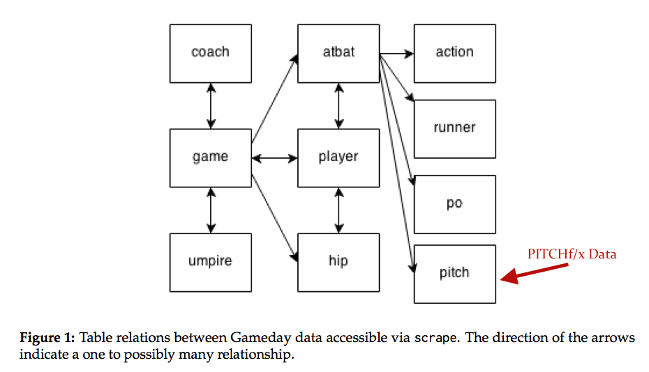
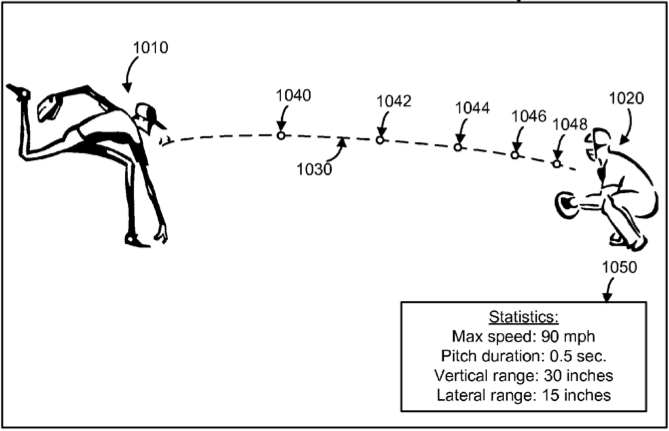
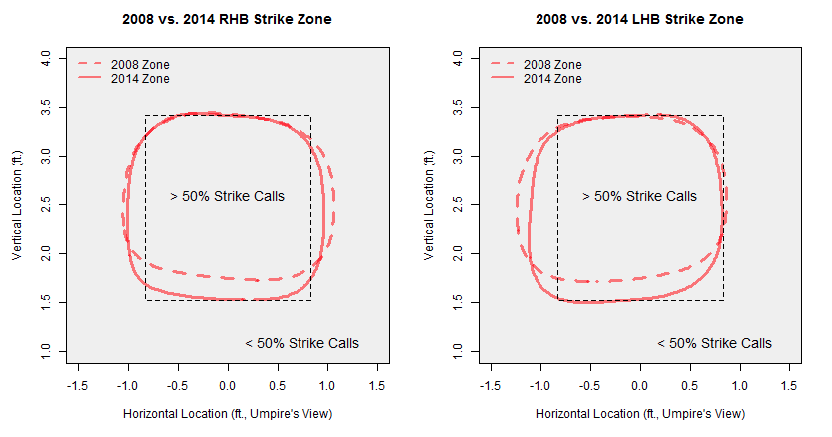
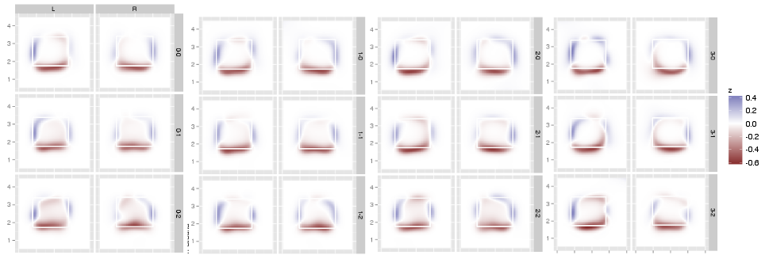
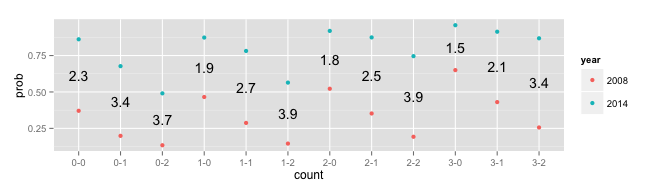
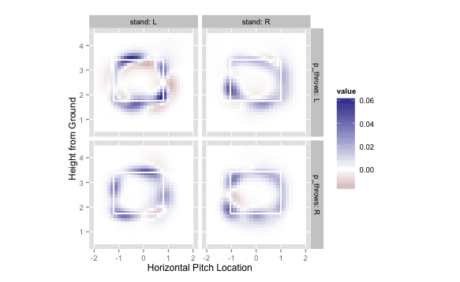

```{r setup, echo = FALSE}
knitr::opts_chunk$set(message = FALSE, eval = FALSE, cache = TRUE, warning = FALSE)
```

# Acquiring PITCHf/x

---

```{r}
library(pitchRx)
# returns a list of related tables (see diagram below)
dat <- scrape(start = "2008-01-01", end = Sys.Date())
```

<div align="center">
  
</div>

# Storing PITCHf/x

---

```{r}
db <- dplyr::src_sqlite("pitchRx.sqlite3", create = TRUE)
pitchRx::scrape(start = "2008-01-01", end = Sys.Date(), connect = db$con)
```

> - Any database connection should work!
> - Writes data in streaming chunks to avoid exhausting memory.
> - Keeping your database up-to-date is also easy!

<ul class="build">
```{r}
update_db(db$con)
```
</ul>

> - Add other data!
    * [openWAR estimates](https://baseballwithr.wordpress.com/2014/06/30/pitchrx-meet-openwar-4/) (Baumer, Jensen, Matthews 2013)
    * [Exit Velocity and Distance of Batted Balls](https://baseballwithr.wordpress.com/2015/07/15/obtaining-exit-velocity-and-distance-of-batted-balls/)

# Animating PITCHf/x

---

[Shepard 2013](https://www.reddit.com/r/baseball/comments/1d2z6d/all_of_darvishs_primary_pitches_at_once/)

<div align="center">
  
</div>

---

<div align="center">
  
</div>

## Query/Animate PITCHf/x

Player/date info recorded on the at-bat level.

```{r}
library(dplyr)
atbats <- tbl(db, 'atbat') %>%
  filter(pitcher_name == 'Yu Darvish', batter_name == 'Albert Pujols', 
         date == '2013_04_24')
```

> - Join at-bats with pitches and animate!

<ul class="build">
```{r}
tbl(db, 'pitch') %>%
  inner_join(atbats, by = c('num', 'gameday_link')) %>%
  collect() %>% pitchRx::animateFX()
```
</ul>

---

```{r, echo = FALSE, eval = TRUE, fig.show='animate', fig.align='center', interval=0.05, dev="CairoPNG"}
library(dplyr)
db <- src_sqlite("~/pitchfx/pitchRx.sqlite3")
atbats <- tbl(db, 'atbat') %>%
  filter(pitcher_name == 'Yu Darvish', batter_name == 'Albert Pujols', 
         date == '2013_04_24')
dat <- tbl(db, 'pitch') %>%
  inner_join(atbats, by = c('num', 'gameday_link')) %>%
  collect()
pitchRx::animateFX(dat, layer = ggplot2::coord_fixed())
```

# Modeling called strike decisions

## Inspired from Brian Mills' Work

<div align="center">
  
</div>

---

<ul class="build">
```{r}
# condition on umpire decisions
pitches <- tbl(db, "pitch") %>%
  filter(des %in% c("Called Strike", "Ball")) %>%
  mutate(strike = as.numeric(des == "Called Strike"))
```
</ul>

<ul class="build">
```{r}
# goal is to compare 2008 to 2014
atbats <- tbl(db, "atbat") %>%
  mutate(year = substr(date, 5L, -4L)) %>%
  filter(year %in% c("2008", "2014"))
dat <- left_join(pitches, atbats)
```
</ul>

<ul class="build">
```{r}
library(mgcv)
# 48 (2 x 2 x 12) surfaces!
m <- bam(strike ~ interaction(stand, year, count) +
            s(px, pz, by = interaction(stand, year, count)),
          data = dat, family = binomial(link = 'logit'))
```
</ul>

# Visualizing differences 

---

```{r}
strikeFX(dat, model = m, density1 = list(year = "2008"),
          density2 = list(year = "2014"), 
          layer = facet_grid(count ~ stand))
```

<div align="center">
  
</div>

## Middle of the plate at the knees

<div align="center">
  
</div>

---

<iframe src="viz/index.html" style="border:none; width:2000;"></iframe>

# Quantifying homefield bias in called strikes

---

<div align="center">
  
</div>

## Confidence/credible Intervals for GAMs

> - Form approximate CI on scale of the predictor, then transform to response scale.
    * Pros: computationally cheap
    * Cons: point-wise (not simultaneous); approximate; assumes smoothness parameters are known 
> - Simulate from the posterior and obtain percentiles
    * Pros: simultaneous (not point-wise)
    * Cons: assumes smoothness parameters are known 
> - Parametric bootstrap
    * Pros: simultaneous (as opposed to point-wise); not conditional on smoothness parameters

## Trey's Advice

<div align="center">
  
</div>

# Thank you!

* Special thanks to:
* Brian Mills for comments/discussions on pitchRx and GAMs.
* Mike Lopez for the invitation
