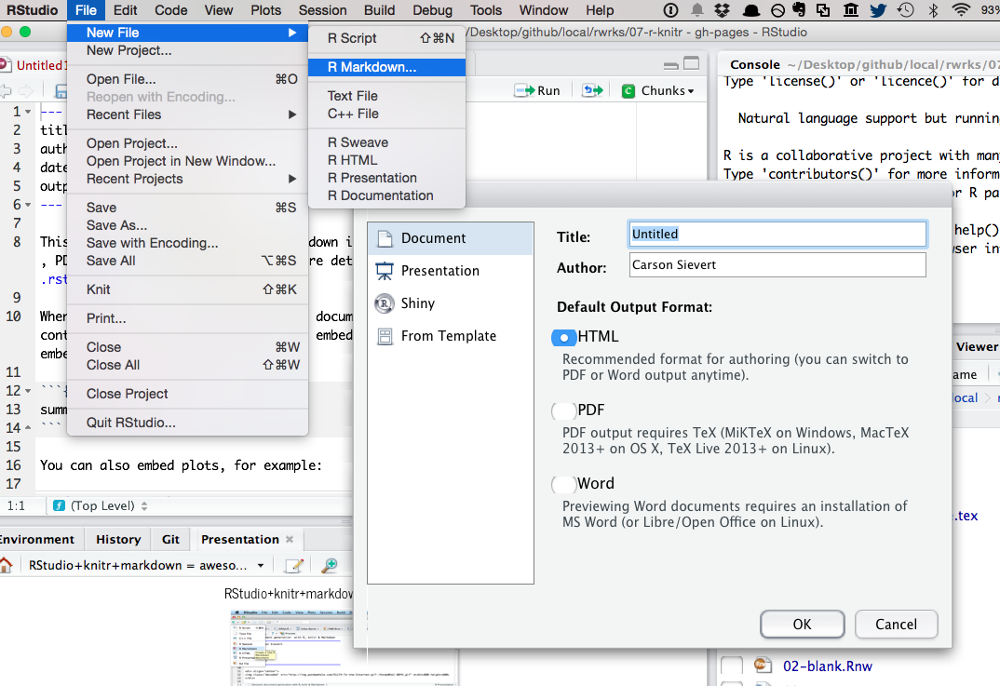
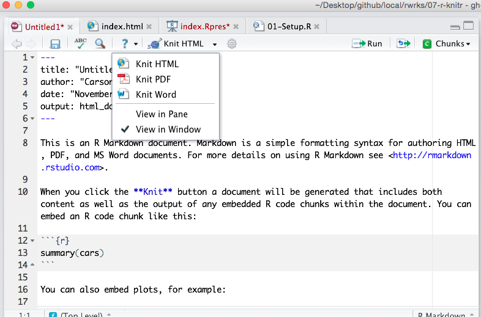
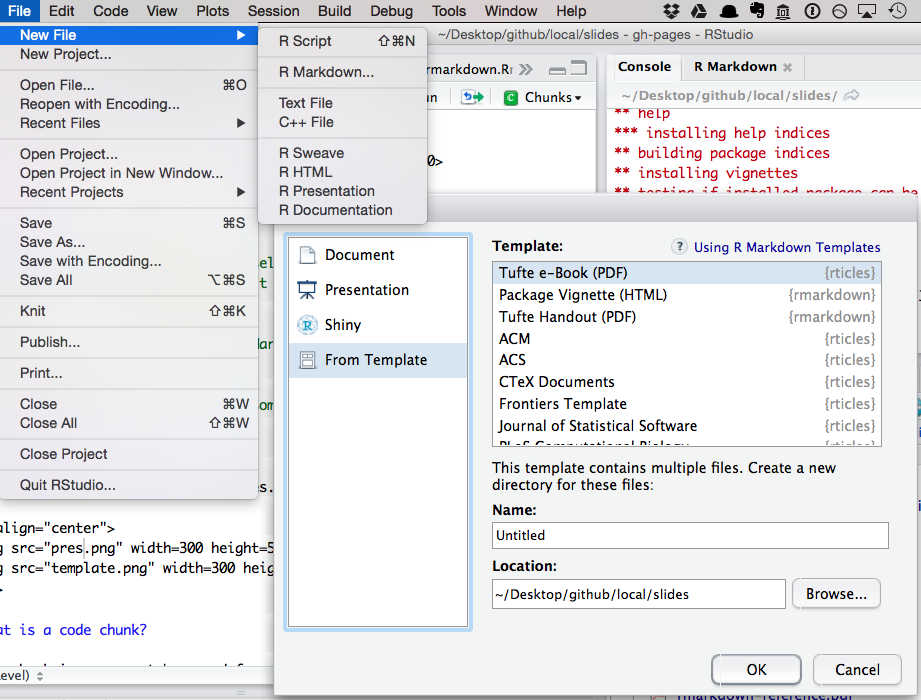
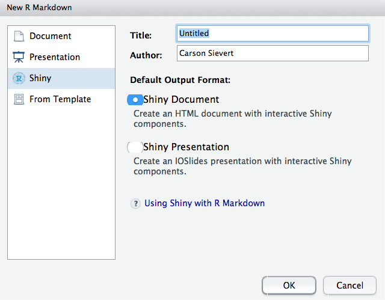

```{r, echo = FALSE, message = FALSE}
knitr::opts_chunk$set(message = FALSE, warning = FALSE, comment = "#>")
# thanks Ramnath -- https://ramnathv.github.io/posts/verbatim-chunks-knitr/
knitr::knit_hooks$set(source = function(x, options){
  if (!is.null(options$verbatim) && options$verbatim){
    opts = gsub(",\\s*verbatim\\s*=\\s*TRUE\\s*", "", options$params.src)
    bef = sprintf('\n\n    ```{r %s}\n', opts, "\n")
    stringr::str_c(
      bef, 
      knitr:::indent_block(paste(x, collapse = '\n'), "    "), 
      "\n    ```\n"
    )
  } else {
    stringr::str_c("\n\n```", tolower(options$engine), "\n", 
      paste(x, collapse = '\n'), "\n```\n\n"
    )
  }
})
library(ggplot2)
```

## Hello R Markdown!

<div align="center">
  
</div>

## Choose your output format!!

<div align="center">
  
</div>

## Be the great mediator

<div align="center">
  
</div>

## But, be careful what you wish for!

<div align="center">
  
</div>

## _Why_ R Markdown?

> - It's __simple__. Focus on writing, rather than debugging silly errors (I'm looking at you _LaTeX_).
> - It's __flexible__. Markdown was created to simplify writing HTML, but thanks to [pandoc](http://pandoc.org/), Markdown converts to many different formats!
> - It's __dynamic__. Find a critical error? Get a new dataset? Regenerate your report without copy/paste hell!
> - Encourages __transparency__. Collaborators (including your future self) will thank you for integrating your analysis & report.
> - Enables __interactivity/reactivity__. Allow your audience to explore the analysis (rather than passively read it).

## First things first, _what_ is Markdown?

> - Markdown is a particular type of markup language.
> - Markup languages are designed produce documents from plain text.
> - Some of you may be familiar with _LaTeX_. This is another (less human friendly) markup language for creating pdf documents.
> - _LaTeX_ gives you much greater control, but it is restricted to pdf and has a __much__ greater learning curve.
> - Markdown is becoming a standard. Many websites will generate HTML from Markdown (e.g. GitHub, Stack Overflow, reddit).

## _Who_ is using R Markdown, and _for what_?

* The [R Markdown website](http://rmarkdown.rstudio.com/) is built with R Markdown.
* The [new edition of the ggplot2 book](https://github.com/hadley/ggplot2-book/) uses it.
* R package vignettes (for example, [I made this for plotly](http://cpsievert.github.io/plotly/pipe-dsl/)).
* [Many](http://lincolnmullen.com/projects/dh-r/index.html) great [tutorials](http://renkun.me/learnR/) use R markdown add-ons such as [Rgitbook](http://jason.bryer.org/Rgitbook/).
* People are [blogging with it](http://cpsievert.github.io/knitr-jekyll//2015/04/jekyll-tufte-servr.html).
* I, for one, am _trying_ to write my dissertation with it.

## What is _R_ Markdown?

* Straight from the [R Markdown home page](http://rmarkdown.rstudio.com/):

> R Markdown is an authoring format that enables easy creation of dynamic documents, presentations, and reports from R. It combines the core syntax of __markdown__ (an easy-to-write plain text format) __with embedded R code chunks__ that are run so their output can be included in the final document. R Markdown documents are fully reproducible (they can be automatically regenerated whenever underlying R code or data changes).

## Your Turn

Study the first page of the [R Markdown Reference Guide](rmarkdown-reference.pdf). 

Yes, the _entire_ markdown syntax can be described in one page!

Can you think of anything that is missing from the syntax (that you might want when creating documents)?

## Markdown doesn't natively support...

> - Stuff you'd find in academic publications:
    * Figure/table referencing
    * Table of contents
> - Many, many appearance related things (image/figure alignment, coloring, font families, etc.) 

---

<div align="center">
  
</div>

## There is hope...

> - You don't _have to_ restrict yourself to markdown. You can always include HTML/`LaTeX` markup, but don't expect it to convert between output formats.

> - There are many efforts to extend Markdown (but, then again, keeping it simple is the point!)

> - Awesome people tend to create awesome templates.

## Your Turn 

Have a look at R Markdown presentations and templates.

<div align="center">
  
</div>

__Pro tip__: run `devtools::install_github("rstudio/rticles")` to get more templates

## Yaml Front Matter

The stuff at the top of the .Rmd file (called yaml front matter) tells __rmarkdown__ what output format you want. 

```
---
title: "Untitled"
date: "June 9, 2015"
output: html_document
---
```

In this case, when you click "Knit HTML", RStudio calls `rmarkdown::render("file.Rmd", html_document())`. You can certainly change these default values (see the [source of this presentation](https://raw.githubusercontent.com/cpsievert/slides/gh-pages/rmd/index.Rmd)).

## What is a code chunk?

A code chunk is a concept borrowed from the [knitr](http://yihui.name/knitr/) package (which, in turn, was inspired by [literate programming](http://en.wikipedia.org/wiki/Literate_programming)). In .Rmd files, you can start/end a code chunk with three back-ticks.

```{r chunk1, verbatim = TRUE}
1 + 1
```

Want to run a command in another language?

```{r chunk2, engine = 'python', verbatim = TRUE}
print "a" + "b"
```

## Code chunk options

There are a plethora of [chunk options](http://yihui.name/knitr/options/) in __knitr__ (engine is one of them). Here are some that I typically use:

* `echo`: Show the code?
* `eval`: Run the code?
* `message`: Relay messages?
* `warning`: Relay warnings?
* `fig.width` and `fig.height`: Change size of figure output.
* `cache`: Save the output of this chunk (so we don't have to run it next time)?

## Your Turn

Study the second page of the [R Markdown Reference Guide](rmarkdown-reference.pdf) and go back to the [Hello R Markdown example](hello_rmarkdown.Rmd)

__Easy__: Modify the figure sizing and alignment.

__Medium__: Add a figure caption.

__Hard__: Can you create an animation? (Hint: look at the `fig.show` chunk option -- you might need to the __animation__ package for this)

__Pro Tip__: Don't like the default chunk option value? Change it at the top of the document:

```{r setup, verbatim = TRUE}
knitr::opts_chunk$set(message = FALSE, warning = FALSE)
```

## Chunk hooks

* From [the documentation](http://yihui.name/knitr/hooks/)

> Chunk hooks are functions to be called before or after a code chunk when the chunk option

```{r hook, verbatim = TRUE}
library(knitr)
knit_hooks$set(small.mar = function(before, options, envir) {
    if (before) par(mar = c(4, 4, .1, .1))  # smaller margin on top and right
})
```

Then use it like this:

```{r histogram, small.mar = TRUE, verbatim = TRUE}
hist(rnorm(100), main = '')
```

## Your Turn

Copy/paste the chunk hook (on the previous slide) into your R Markdown file. Notice the difference in margins.

## Formatting R output

```{r}
m <- lm(mpg ~ disp, data = mtcars)
summary(m) # output isn't very attractive
```

---

[pander](http://rapporter.github.io/pander/) is one great option.

```{r}
library(pander)
pander(m)
```

---

```{r}
a <- anova(m)
a
```

---

```{r}
pander(a)
```

## Pander knows about a lot of stuff!

```{r}
methods(pander)
```

## Your Turn 

* Look through the list of pander methods. Can you apply any of the methods that we haven't discussed? We just saw `pander.lm` and `pander.anova`.

## Interactive Stuff

```{r}
d <- diamonds[sample(nrow(diamonds), 1000), ]
DT::datatable(d)
```

---

```{r}
library(plotly)
p <- ggplot(data = d, aes(x = carat, y = price, colour = clarity)) +
  geom_point(aes(text = cut), size = 3) + geom_smooth() + facet_wrap(~ clarity)
ggplotly(p)
```

## Reactive documents with shiny!

<div align="center">
  
</div>
