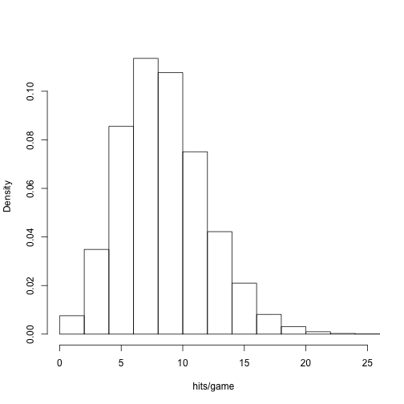
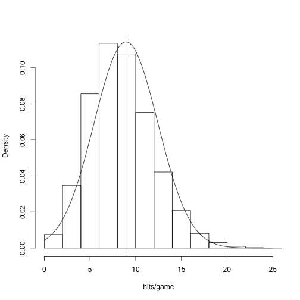
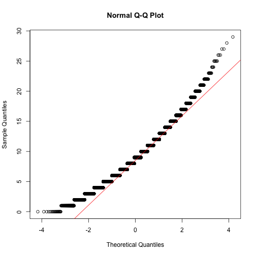

Stat 226 - Assessing Normality
========================================================
date: 09/26/13
transition: rotate
incremental: true

Histogram of hits per game in baseball
========================================================

 

***

* Pretty close to a symmetric, bell-shaped distribution. Let's fit a normal distribution to it!

Fitting a normal distribution to data
========================================================

 

***

* We can fit a normal distribution to this data by:
  * setting the mean parameter $\mu$ equal to the sample mean $\bar{x}$ = 8.9368
  * setting the variance parameter $\sigma^2$ equal to the sample variance $s^2$  = 3.4897
  
  
Making approximate inference with empirical rule
========================================================

 

***

* The empirical rule tells us about 68% of the normal curve falls within one standard deviation of the mean.
* Note that the mean is 8.94 and the standard deviation is 3.49.
* If we were to pick __one__ random game, there is roughly a 68% chance of there being between  (8.94 - 3.49, 8.94 + 3.49) => (5.45, 12.43) hits in that game.

Is runs per game really normally distributed??
========================================================

 

***
* If runs/game was _perfectly_ normal, the points would fall _exactly_ on the red line.
* Since nothing is _perfectly_ normal, we expect _some_ deviation from this line.
* The real question is whether this deviation is _significant_. If the deviation is _significant_, the distribution of runs/game is probably not normal.
* Suppose the deviation here is significant. What does that imply?
