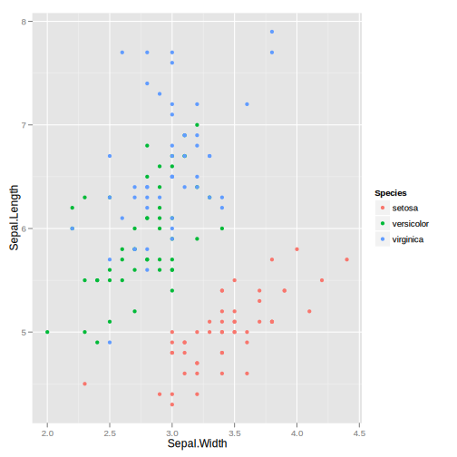

```{r setup, echo = FALSE}
knitr::opts_chunk$set(message = FALSE, eval = FALSE)
```

## ... _on the Web_

<div align="center">
  
</div>

## Why interactive graphics _on the Web_?

1. Portable (web browser)
1. Simple (share via URL)
1. Reach (everyone has internet, right?)

# The naive approach: figure converters
---

```{r}
library(animint)
p <- qplot(data = iris, x = Sepal.Width, y = Sepal.Length, color = Species)
structure(list(p = p), class = "animint")
```

<!--
<iframe src="animint/index.html" scrolling="no" style="border:none;"></iframe>
-->

---

```{r}
library(plotly)
ggplotly(p)
```

<!--
<iframe src="plotly1/index.html" scrolling="no" style="border:none;"></iframe>
-->

---

```{r}
library(gridSVG)
gridsvg("iris.svg")
  p
dev.off()
```



## Thoughts on figure converters

> - Pros:
    * No HTML/JS/CSS knowledge required
    * In some cases, doesn't require learning anything new
> - Cons:
    * Hard to extend, customize, and/or add (interactive) features
    * Conversion isn't 1-to-1

# Bindings to Reusable Charts
---

> - General idea:
    * Start with a HTML/JS/CSS template
    * Abstract away data and layout/appearance options
    * Map a set of R objects to that template

<ul class="build">
```r
myWrapper <- function(...) {
  # precompute something
  toJSON(list(...))
}
```
</ul>

> - [htmlwidgets](http://www.htmlwidgets.org/) makes it easy to write bindings that play nicely with shiny/rmarkdown/RStudio. 

---

```{r}
(p <- plot_ly(z = volcano, type = "surface"))
```

<!--
<iframe src="plotly3/index.html" scrolling="no" style="border:none;"></iframe>
-->

---

```{r}
str(p)
#> Classes ‘plotly’ and 'data.frame':	0 obs. of  0 variables
#>  - attr(*, "plotly_hash")= chr "d72417c2f38125f11112cd6591f06f2e#2"

str(plotly_build(p))
#> List of 4
#>  $ data          :List of 1
#>   ..$ :List of 3
#>   .. ..$ type      : chr "surface"
#>   .. ..$ z         : num [1:87, 1:61] 100 101 102 103 104 105 105 106 107 108 ...
#>   .. ..$ colorscale:'data.frame':	10 obs. of  2 variables:
#>   .. .. ..$ : num [1:10] 0 0.111 0.222 0.333 0.444 ...
#>   .. .. ..$ : Factor w/ 10 levels "#1F9D89","#26838E",..: 6 7 5 3 2 1 4 8 9 10
#>  $ layout        :List of 1
#>   ..$ zaxis:List of 1
#>   .. ..$ title: chr "volcano"
```

---

<div align="center">
  
</div>

---

```{r}
plot_ly(economics, x = date, y = uempmed, mode = "markers") %>%
  add_trace(y = fitted(forecast::Arima(uempmed, c(1,0,0))), mode = "lines") %>%
### <b>
  dplyr::filter(uempmed == max(uempmed)) %>%
### </b>
  layout(annotations = list(x = date, y = uempmed, text = "Peak", showarrow = T),
         title = "Median duration of unemployment (in weeks)", showlegend = F)
```

<!--
<iframe src="plotly2/index.html" scrolling="no" style="border:none;"></iframe>
-->

## Thoughts on custom bindings

> - Pros:
    * No HTML/JS/CSS knowledge required
> - Cons:
    * How do you abstract away interactivity???

---

<div align="center">
  
</div>

# Thank you!
