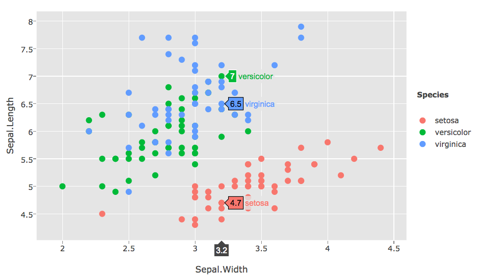
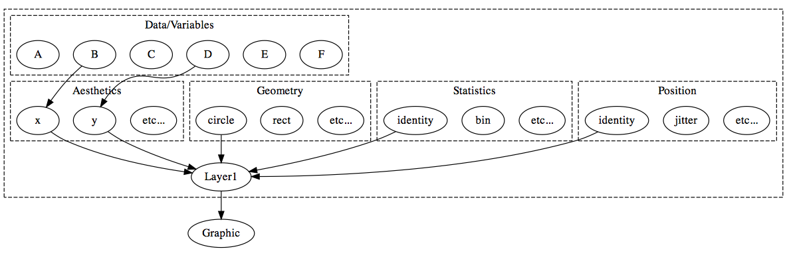
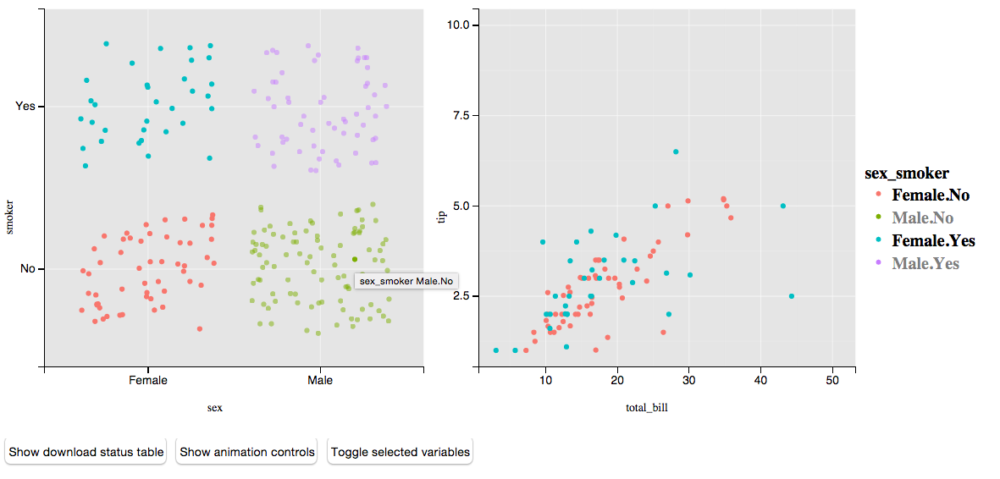

```{r setup, echo = FALSE}
knitr::opts_chunk$set(message = FALSE, eval = FALSE)
```

# Why _interactive_ & _dynamic_ graphics?

<!-- TODO 
* plotly correlation matrix?
* http://kbroman.org/qtlcharts/example/iplotCorr.html
-->

## Example 1

<div align="center">
  <a href="../wehi/bank/"> 
    
  </a>
</div>

## Example 2

<div align="center">
  <a href="LDAvis"> 
    
  </a>
</div>

## Tours

<div align="center">
  <a href="http://localhost:8000"> 
    
  </a>
</div>

# Why _web_ graphics?

## Sharing is easy

<div align="center">
  
</div>

## Creating is _not_ easy

<div align="center">
  
</div>

---

```{r, eval = TRUE, fig.align = 'center', fig.width = 6}
library(ggplot2)
p <- qplot(data = iris, x = Sepal.Width, y = Sepal.Length, color = Species)
p
```

---

```{r}
library(plotly)
ggplotly(p)
```

<div align="center">
  <a href="../wehi/plotly1/"> 
    
  </a>
</div>

---

```{r}
library(animint)
animint2dir(list(plot = p))
```

<div align="center">
  <a href="../wehi/animint/"> 
    
  </a>
</div>

---

<div align="center">
  <a href="https://gallery.shinyapps.io/ggtree"> 
    
  </a>
</div>

---
 
<div align="center">
  
</div>

## Translating R graphics to the web

* Pros:
    * Easy to use -- extrapolates on existing knowledge/code
    * Doesn't require a Web Server running special software
* Cons:
    * Translation may depend on internals of other packages
    * To change something that's serialized, you need to re-run R code
    * Hard to extend, customize, and/or add (interactive) features
  
# Extending ggplot2 to Enable (Int)eractive (Anim)ations

## `ggplot2`'s grammar of graphics

<div align = "center">
  
</div>

* There are 5 components to a layer: Data, Aesthetics, Statistics, Geometry, and Positional Adjustment.
* In __ggplot2__, a plot consists of one _or more_ layers

## `animint`'s extension

<div align = "center">
  
  
</div>

> - Selections operate on the _layer_ (this grants finer control than, say Tableau, where selections operate on the _plot_ level)

## Basic Linked Plot

<div align="center">
  <a href="../wehi/animint2/"> 
    
  </a>
</div>

## The Code

```{r sex-smoker, eval = FALSE}
data(tips, package = "reshape2")
tips$sex_smoker <- with(tips, interaction(sex, smoker))
library(animint)
p1 <- ggplot() + theme(legend.position = "none") +
  geom_point(data = tips, position = "jitter",
             aes(x = sex, y = smoker, colour = sex_smoker,
## <b>
                 clickSelects = sex_smoker))
## </b>
p2 <- ggplot() +
  geom_point(data = tips, 
             aes(x = total_bill, y = tip, colour = sex_smoker,
## <b>
                 showSelected = sex_smoker))
## </b>
plots <- list(
  plot1 = p1, 
  plot2 = p2
)
animint2dir(plots)
```

> - __animint__ also has options for animating through `showSelected` values (e.g., WorldBank viz)
  
    
# R Bindings to JavaScript Libraries

---

> - General idea:
    * Start with a HTML/JS/CSS template
    * Abstract away data and layout/appearance options
    * Map a set of R objects to template

<ul class="build">
```r
myWrapper <- function(...) {
  # compute stuff
  toJSON(list(...))
}
```
</ul>

> - [htmlwidgets](http://www.htmlwidgets.org/) makes it easy to write bindings that play nicely with shiny/rmarkdown/RStudio. 

---

<div align="center">
  
</div>

---

```{r}
library(plotly)
(p <- plot_ly(z = volcano, type = "surface"))
```

<div align="center">
  <a href="../wehi/plotly3/"> 
    
  </a>
</div>

---

```{r}
str(p)
#> Classes ‘plotly’ and 'data.frame':	0 obs. of  0 variables
#>  - attr(*, "plotly_hash")= chr "d72417c2f38125f11112cd6591f06f2e#2"

str(plotly_build(p))
#> List of 4
#>  $ data          :List of 1
#>   ..$ :List of 3
#>   .. ..$ type      : chr "surface"
#>   .. ..$ z         : num [1:87, 1:61] 100 101 102 103 104 105 105 106 107 108 ...
#>   .. ..$ colorscale:'data.frame':	10 obs. of  2 variables:
#>   .. .. ..$ : num [1:10] 0 0.111 0.222 0.333 0.444 ...
#>   .. .. ..$ : Factor w/ 10 levels "#1F9D89","#26838E",..: 6 7 5 3 2 1 4 8 9 10
#>  $ layout        :List of 1
#>   ..$ zaxis:List of 1
#>   .. ..$ title: chr "volcano"
```

---

```{r}
plot_ly(economics, x = date, y = uempmed, mode = "markers") %>%
  add_trace(y = fitted(forecast::Arima(uempmed, c(1,0,0))), mode = "lines") %>%
### <b>
  subset(uempmed == max(uempmed)) %>%
### </b>
  layout(annotations = list(x = date, y = uempmed, text = "Peak", showarrow = T),
         title = "Median duration of unemployment (in weeks)", showlegend = F)
```

<div align="center">
  <a href="../wehi/plotly2/"> 
    
  </a>
</div>

# Looking towards the future

---

<div align="center">
  
</div>

---

<div align="center">
  
</div>

---

<div align="center">
  
</div>

---

<div align="center">
  
</div>


## Thanks to my collaborators

* __animint__ (Toby Dylan Hocking, Susan VanderPlas, Kevin Ferris, and Tony Tsai)
  
* __plotly__ (Toby Dylan Hocking, Chris Parmer, [Plotly Team](https://plot.ly/company/team/), and [ropensci](https://ropensci.org/))
  
* __LDAvis__ (Kenny Shirley)

# Thanks for listening!

* Twitter -> <https://twitter.com/cpsievert>
* GitHub -> <https://github.com/cpsievert>
