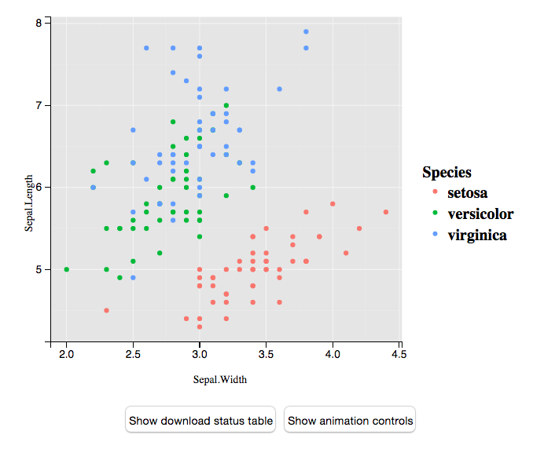

```{r setup, echo = FALSE}
knitr::opts_chunk$set(message = FALSE, eval = FALSE)
```

## Bio

* B.A. in Math & Economics, __Saint John’s University__ (06-10)
* Data Analyst, __College Enrollment & Financial Aid Consulting Firm__ (10-11)
* M.S. in Statistics, __Iowa State University__ (11-13)
    * __Thesis__: Tools for Collecting and Analyzing MLB PITCHf/x Data (__pitchRx__).
* Research Intern, __Statistics Research Department at AT&T Labs__ (Summer '13)
    * Worked with Dr. Kenny Shirley on __LDAvis__ and __LDAtools__.
* Took PhD courses and passed written qualifying exam (13-14)
* Student, __Google Summer of Code__ (Summer '14)
    * Began work on __animint__
* Teaching Assistant, __Iowa State University__ (11-15)
* Mentor, __Google Summer of Code__ (Summer '15)
* Software Developer, __plotly__ (Summer '15 - Present)
* Research Assistant, __Monash University__ (Sept '15 - Present)

## Proposal Overview

* The importance of interface design
* Interfaces for working with web content
* Interfaces for acquiring data on the web
* __Dynamic interactive statistical web graphics__
    * Why interactive?
    * Indirect versus direct manipulation
    * __Linked views and pipelines__
    * __Web graphics__
    * __Translating R graphics to the web__
    * __R interfaces for interactive web graphics__

## Motivation

* Why _interactive_ & _dynamic_ graphics? They help us:
    * Find high-dimensional, abstract relationships in data that may otherwise go unnoticed
    * Diagnose models by visualizing them in the data space (Wickham, Cook, & Hofmann 2015)
    * Explore and understand complicated fitted statistical model(s) (Example to follow)
    * Communicate/share our work with others in a compelling way

* Why _web-based_?
    * simple to share, portable (web browser)
    * encourages composability
    * guide your audience by providing links to interesting selections/states

## Latent Dirichlet Allocation (Blei, Ng, Jordan; 2003)

<div align="center">
  
</div>

In the digital humanities (& elsewhere), LDA is often used to "discover topics" in a large collection of text documents. How are researchers supposed to interpret these topics?

---

### Generative Model
<p></p>
1. For each document $d$, draw topic distribution $\theta_d \sim Dir(\alpha)$
2. For each topic $k$, draw term distribution $\phi_k \sim Dir(\beta)$
3. Let $N_d$ be # of words in doc $d$ and $n \in \{1, \dots, N_d\}$. For each word $w_{d, n}$:
    * Draw a (latent) topic, $z_{d, n} \sim Mult(1, \theta_d)$
    * Draw a word given topic, $w_{d, n} \sim Mult(1, \phi_{z_{d, n}})$
    
### Model fitting
<p></p>
* Griffiths & Steyvers (2004) derive a collapsed Gibbs sampler. Implemented in R packages __LDAtools__ (Shirley & Sievert, 2013) and __lda__ (Chang, 2015).
* Wide array of fitting algorithms available in __topicmodels__ (Grun & Hornik, 2011) and __mallet__ (Mimno, 2013).


## Towards topic interpretation

* Each topic owns a _different_ pmf over a set vocabulary.
* __<font color="red">Problem</font>:__ We can't possibly examine each pmf. <b>Where should we put our focus?</b>

<ul class="build">
* Numerous interactive systems allow users to select a topic $z$, then list top ~30 words based on $p(w | z)$ (Gardner et al., 2010; Chaney and Blei, 2012; Snyder et al., 2013).
* But, words likely to occur overall are also likely to occur for a given topic!
* Taddy (2011) proposed to rank terms by $lift = p(w | z)/p(w)$
* But if $p(w)$ is small, $lift$ is large!
* Bischof and Airoldi (2012) propose a new model to directly estimate an average frequency and exclusivity to a given topic.
* Sievert & Shirley (2014) propose choosing $0 < \lambda < 1$, for:
$$
\text{relevance}(\lambda) = \lambda * p(w|z) + (1 - \lambda) * \text{lift}
$$
</ul>

---

<div align="center">
  <a href="../murdoch/LDAvis/#topic=4">
    
  </a>
</div>


---

<div align="center">
  <a href="../murdoch/LDAvis/#topic=4"> 
    
  </a>
</div>

---

<div align="center">
  <a href="../murdoch/LDAvis/#topic=4"> 
    
  </a>
</div>


---

<div align="center">
  <a href="../murdoch/LDAvis/#topic=15&lambda=0.56&term=win"> 
    
  </a>
</div>

<!-- Notes
http://localhost:8000/#topic=15&lambda=0.56&term=win

The word "win" is probably an abbreviation for "windows" in topic 15. By hovering over "win", we reveal its conditional topic distribution, which is useful finding different uses of that word. Topics 9 and 26 seems to be discussing baseball and hockey, so win is probably referring to "winning games". Topic 39 also seems to be related to sports, but many of the releavnt terms are abbreviations, so "win" may be a team code.
-->


## Who is using it?

* People who use LDA and want a tool for interpreting topics.
* Combined __LDAvis__ and __pyLDAvis__ currently have 356 stars on GitHub (a measure of popularity).
* I know a number of consultants and industry workers using it for both exploration and presentation.
* Dr. Grant Arndt in the Department of Anthropology at Iowa State University  (and his research assistant) are using it as a research aid.
* Enabling users to extract and communicate insight deriving from sophicated statistical models.

## We need better tools

* Producing interactive and dynamic web graphics from "scratch" (i.e., using HTML/JavaScript/CSS/SVG/d3js) is time-consuming, but very powerful, and flexible.
* People doing data analysis & statistics don't have the time to learn all these tools. In general, how do we best enable them to create their own interactive dynamic web graphics?
* I've worked on two R packages in this direction: __animint__ and __plotly__.
* Both can translate __ggplot2__ (Wickham, 2009) graphics to a web-based format (SVG/canvas) and add-on some basic interactive features.
* Mention the userbase.

---

```{r, eval = TRUE, fig.align = 'center', fig.width = 6}
library(ggplot2)
p <- qplot(data = iris, x = Sepal.Width, y = Sepal.Length, color = Species)
p
```

---

```{r}
library(plotly)
ggplotly(p)
```

<div align="center">
  <a href="plotly.html"> 
    
  </a>
</div>

---

```{r}
library(animint)
animint2dir(list(plot = p))
```


<div align="center">
  <a href="../wehi/animint/"> 
    
  </a>
</div>

---

<div align="center">
  <a href="https://gallery.shinyapps.io/ggtree"> 
    
  </a>
</div>

---

Fix typo!!!

<div align="center">
  
</div>

## Translating R graphics to the web

* Pros:
    * Easy to use -- extrapolates on existing knowledge/code
    * Doesn't require a Web Server running special software
* Cons:
    * Translation may depend on internals of other packages
    * To change something that's serialized, you need to re-run R code
    * Hard to extend, customize, and/or add (interactive) features
    
> - Although pragmatic, if we want a truly interactive web graphics tool, we need a custom interface/language designed for that purpose.
> - Many relevant R packages provide bindings to JavaScript libraries through a JSON specification (e.g., __ggvis__ (Chang & Wickham, 2015), __rbokeh__ (Hafen & Bokeh team, 2015), __plotly__ (Sievert & Plotly team, 2015))

## R Bindings to JavaScript Libraries

* General idea:
    * Start with a HTML/JS/CSS template
    * Abstract away data and layout/appearance options
    * Map a set of R objects to template

```r
myWrapper <- function(...) {
  # compute stuff
  toJSON(list(...))
}
```

* The R package [__htmlwidgets__](http://www.htmlwidgets.org/) makes it easy for authors to write bindings that play nicely with shiny/rmarkdown/RStudio. 

---

<div align="center">
  
</div>

---

```{r}
library(plotly)
plot_ly(z = volcano, type = "surface")
```

<div align="center">
  <a href="../wehi/plotly3/"> 
    
  </a>
</div>

---

Talk about pipes!

---

```{r}
p <- plot_ly(z = volcano, type = "surface")
str(p)
#> Classes ‘plotly’ and 'data.frame':	0 obs. of  0 variables
#>  - attr(*, "plotly_hash")= chr "d72417c2f38125f11112cd6591f06f2e#2"

str(plotly_build(p))
#> List of 4
#>  $ data          :List of 1
#>   ..$ :List of 3
#>   .. ..$ type      : chr "surface"
#>   .. ..$ z         : num [1:87, 1:61] 100 101 102 103 104 105 105 106 107 108 ...
#>   .. ..$ colorscale:'data.frame':	10 obs. of  2 variables:
#>   .. .. ..$ : num [1:10] 0 0.111 0.222 0.333 0.444 ...
#>   .. .. ..$ : Factor w/ 10 levels "#1F9D89","#26838E",..: 6 7 5 3 2 1 4 8 9 10
#>  $ layout        :List of 1
#>   ..$ zaxis:List of 1
#>   .. ..$ title: chr "volcano"
```

---

```{r}
plot_ly(economics, x = date, y = uempmed, mode = "markers") %>%
  add_trace(y = fitted(forecast::Arima(uempmed, c(1,0,0))), mode = "lines") %>%
### <b>
  subset(uempmed == max(uempmed)) %>%
### </b>
  layout(annotations = list(x = date, y = uempmed, text = "Peak", showarrow = T),
         title = "Median duration of unemployment (in weeks)", showlegend = F)
```

<div align="center">
  <a href="../wehi/plotly2/"> 
    
  </a>
</div>

# Enabling coordinated, linked views

---

* Coordinated, linked views is an important quality of any interactive statistical graphics system (e.g., cranvas, ggobi, iplots, mondrian, MANET, etc).
* In order to have linked views, we need a "data pipeline" (Buja et.al, 1988); (Wickham et. al., 2010).

<div align="center">
  
</div>

<!--
* Providing a reusable "closed" template, such as __LDAvis__ is easy. What if users want to extend/remix it?
* The R package __shiny__ (Cheng et. al., 2015) empowers R users to create web applications with very little startup costs.
* __shiny__ makes indirect manipulation easy, but coordinating linked views is still hard (especially with smooth transitions between views).
-->

---

<div align="center">
  
</div>

---

<div align="center">
  
</div>

---

<div align="center">
  
</div>

---

<div align="center">
  
</div>

---

<div align="center">
  
</div>


## Things I'd like to work on

* Easy:
    * Once plotlyjs has native support for a "selection brush", allow users to access selections in shiny (just like click example).
    * Interface for binding to plotly events _with_ JavaScript callbacks (for users that _do_ know JS).

* Hard: 
    * Interface for binding to plotly events _without_ JavaScript callbacks (for users that _don't_ know JS).

## Timeline

* __December:__ Revise and resubmit book chapter on MLB Pitching Expertise and Evaluation for the Handbook of Statistical Methods for Design and Analysis in Sports, a volume that is planned to be one of the Chapman & Hall/CRC Handbooks of Modern Statistical Methods.
* __January:__ Revise and submit animint paper.
* __Feburary:__ Linked views in plotly.
* __April:__ Write and submit curating data paper.
* __June:__ Write and submit interactive web graphics paper.
* __August:__ Thesis defense.

## Thanks to my collaborators

* __LDAvis__ (Kenny Shirley)
* __animint__ (Toby Dylan Hocking, Susan VanderPlas, Kevin Ferris, and Tony Tsai)
* __plotly__ (Toby Dylan Hocking and the [Plotly Team](https://plot.ly/company/team/))
