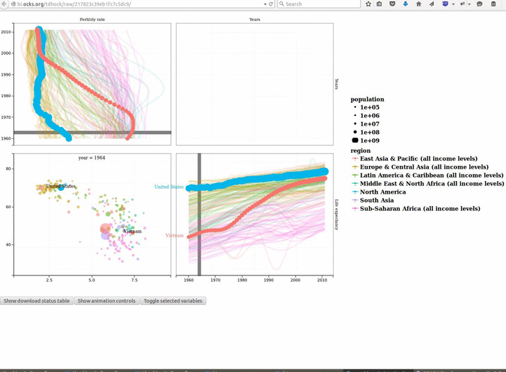

```{r setup, echo = FALSE}
knitr::opts_chunk$set(message = FALSE, eval = FALSE)
```

## Why _interactive_ graphics?

> - "Any visualization of high dimensional data has to be compressed in some way, but interactivity allows us to get details" (Karl Broman, JSM 2015).
> - Famous InfoVis mantra: Overview first, zoom and filter, then details on demand (Schneiderman, 1996).

## Why _interactive_ graphics _on the Web_?

> - Portable (web browser)
> - Simple (share via URL)
> - Reach (everyone has internet, right?)

# Figure converters

---

```{r, eval = TRUE, fig.align = 'center', fig.width = 6}
library(ggplot2)
p <- ggplot(data = iris) + 
  geom_point(aes(x = Sepal.Width, y = Sepal.Length, color = Species))
p
```

---

```{r}
library(animint)
animint2dir(list(plot = p))
```

<div align="center">
  <a href="animint/"> 
    
  </a>
</div>

---

```{r}
library(plotly)
ggplotly(p)
```

<div align="center">
  <a href="plotly1/"> 
    
  </a>
</div>

---

<div align="center">
  <a href="https://gallery.shinyapps.io/ggtree"> 
    
  </a>
</div>

---
 
<div align="center">
  
</div>

## Thoughts on figure converters

> - Pros:
    * Users don't need HTML/JS/CSS knowledge
    * Doesn't require a Web Server running special software
    * Easy to use -- extrapolates on existing knowledge/code
> - Cons:
    * Serialization depends on internals of other packages
    * To change something that's serialized, you need to re-run R code
    * Hard to extend, customize, and/or add (interactive) features

# Extending ggplot2 to Enable (Int)eractive (Anim)ations

## `ggplot2`'s grammar of graphics

<div align = "center">
  
</div>

> - There are 5 components to a layer: Data, Aesthetics, Statistics, Geometry, and Positional Adjustment.
> - In __ggplot2__, a plot consists of one _or more_ layers

## `animint`'s extension

<div align = "center">
  
  
</div>

> - Selections operate on the _layer_ (this grants finer control than, say Tableau, where selections operate on the _plot_ level)

## Basic Linked Plot

<div align="center">
  <a href="animint2/"> 
    
  </a>
</div>

## The Code

```{r sex-smoker, eval = FALSE}
data(tips, package = "reshape2")
tips$sex_smoker <- with(tips, interaction(sex, smoker))
library(animint)
p1 <- ggplot() + theme(legend.position = "none") +
  geom_point(data = tips, position = "jitter",
             aes(x = sex, y = smoker, colour = sex_smoker,
## <b>
                 clickSelects = sex_smoker))
## </b>
p2 <- ggplot() +
  geom_point(data = tips, 
             aes(x = total_bill, y = tip, colour = sex_smoker,
## <b>
                 showSelected = sex_smoker))
## </b>
plots <- list(
  plot1 = p1, 
  plot2 = p2
)
animint2dir(plots)
```

## What does `clickSelects`+`showSelected` buy us?

> - In general, `clickSelects`+`showSelected` specifies a link between m and n observations.
> - Statistically speaking, this yields sets of visualizations of *conditional* distributions -- where the conditioning variable is *categorical*.
> - If you want to condition on a *quantitative* variable, you can discretize beforehand. 
> - This kind of linked selection can be extended to other techniques (for example, `hoverSelects`).
> - A number of other interative features have fit nicely into this framework:
    * `tooltip` aesthetic for labelling.
    * `time` option for automatic iteration and interpolation between views (in other words, animation).

## (Grand) tour

<div align="center">
  <a href="rivera/"> 
    
  </a>
</div>

## WorldBank Viz

<div align="center">
  <a href="bank/"> 
    
  </a>
</div>

---

Behold, the HTML file for all of these animint plots!!!

```html
<html>
  <head>
## <b>
    <script type="text/javascript" src="animint.js"></script>
## </b>
  </head>
  <body>
    <div id="plot" align="center"> </div>
    <script>
      var plot = new animint("#plot","plot.json");
    </script>
  </body>
</html>
```

# How do we ensure visualizations render properly?

---

> - [RSelenium](http://cran.r-project.org/web/packages/RSelenium/index.html) allows you to program any modern Web browser from R.

<ul class="build">
```{r}
library(RSelenium)
startServer()
remDr <- remoteDriver(browserName = "firefox")
remDr$open()
remDr$navigate("http://www.r-project.org")
# returns the DOM as HTML
src <- remDr$getPageSource()
```
</ul>

> - Can also do fancier stuff like handle user events (mouse clicks, press keys, etc.)
> - If you just need to access the DOM, [rdom](https://github.com/cpsievert/rdom) is easier and more reliable.

<ul class="build">
```{r}
src <- rdom::rdom("http://www.r-project.org")
```
</ul>

# R Bindings to JavaScript Libraries

---

> - General idea:
    * Start with a HTML/JS/CSS template
    * Abstract away data and layout/appearance options
    * Map a set of R objects to template

<ul class="build">
```r
myWrapper <- function(...) {
  # compute stuff
  toJSON(list(...))
}
```
</ul>

> - [htmlwidgets](http://www.htmlwidgets.org/) makes it easy to write bindings that play nicely with shiny/rmarkdown/RStudio. 

---

<div align="center">
  
</div>

---

```{r}
library(plotly)
(p <- plot_ly(z = volcano, type = "surface"))
```

<div align="center">
  <a href="plotly3/"> 
    
  </a>
</div>

---

```{r}
str(p)
#> Classes ‘plotly’ and 'data.frame':	0 obs. of  0 variables
#>  - attr(*, "plotly_hash")= chr "d72417c2f38125f11112cd6591f06f2e#2"

str(plotly_build(p))
#> List of 4
#>  $ data          :List of 1
#>   ..$ :List of 3
#>   .. ..$ type      : chr "surface"
#>   .. ..$ z         : num [1:87, 1:61] 100 101 102 103 104 105 105 106 107 108 ...
#>   .. ..$ colorscale:'data.frame':	10 obs. of  2 variables:
#>   .. .. ..$ : num [1:10] 0 0.111 0.222 0.333 0.444 ...
#>   .. .. ..$ : Factor w/ 10 levels "#1F9D89","#26838E",..: 6 7 5 3 2 1 4 8 9 10
#>  $ layout        :List of 1
#>   ..$ zaxis:List of 1
#>   .. ..$ title: chr "volcano"
```

---

```{r}
plot_ly(economics, x = date, y = uempmed, mode = "markers") %>%
  add_trace(y = fitted(forecast::Arima(uempmed, c(1,0,0))), mode = "lines") %>%
### <b>
  dplyr::filter(uempmed == max(uempmed)) %>%
### </b>
  layout(annotations = list(x = date, y = uempmed, text = "Peak", showarrow = T),
         title = "Median duration of unemployment (in weeks)", showlegend = F)
```

<div align="center">
  <a href="plotly2/"> 
    
  </a>
</div>

## Thoughts on JavaScript bindings

> - Defaults/abstractions matter!
    * Best when used to attack a specific problem/task
> - Pros:
    * Users don't need HTML/JS/CSS knowledge
    * Package authors can easily bring the best of JavaScript to R
> - Cons:
    * JavaScript developers don't think like statisticians
    * How do you abstract away reactivity/interactivity???

## Custom JS bindings applied to a specific problem

<div align="center">
  <a href="http://cpsievert.github.io/LDAvis/newsgroup/vis/#topic=17&lambda=1&term="> 
    
    </a>
</div>

## Final Thoughts

> - Web-based interactive statistical graphics are not (yet) as fully featured as non Web-based options (see loon, cranvas, mondrian, ggobi, MANET, LISP-STAT, DataDesk, etc.)
> - Plea to developers: 
    * build tools for domain specific problems (see qtlcharts, LDAvis)
    * focus less on features, more on what your audience really needs to solve the problem
    
## My Awesome Collaborators

* __animint__ (Toby Dylan Hocking, Susan VanderPlas, Kevin Ferris, and Tony Tsai)
  
* __plotly__ (Toby Dylan Hocking, Chris Parmer, [Plotly Team](https://plot.ly/company/team/), and [ropensci](https://ropensci.org/))
  
* __LDAvis__ (Kenny Shirley)

# Thanks for listening!

* Slides -> <http://bit.ly/wehi_15/>
* Twitter -> <https://twitter.com/cpsievert>
* GitHub -> <https://github.com/cpsievert>
