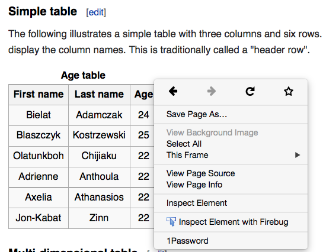
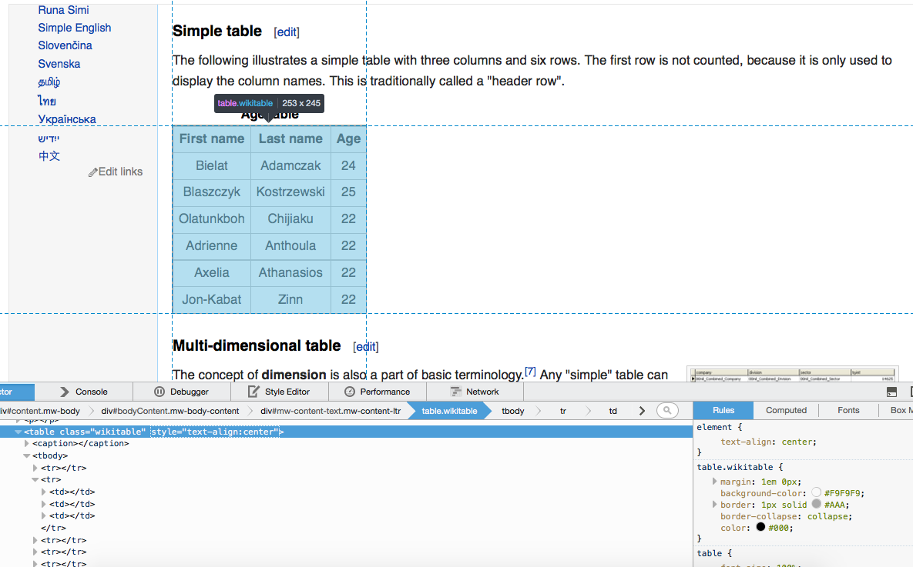
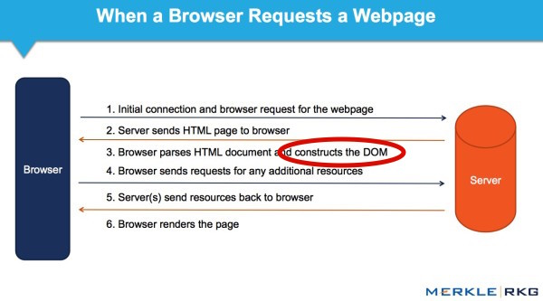
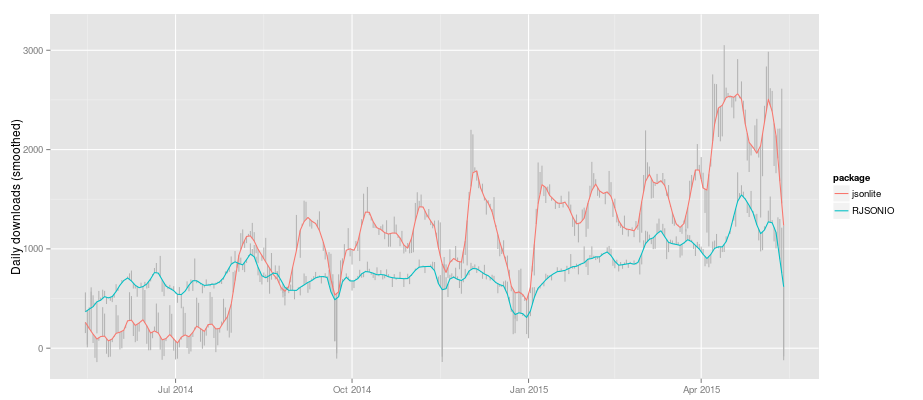

```{r setup, echo=FALSE, message=FALSE}
library(knitr)
opts_chunk$set(message = FALSE, cache = TRUE, warning = FALSE)
```

## Curiosity

<div align = "center">
 
</div>

## Leads to search

<div align = "center">
 
</div>

## Leads to discovery!

<div align = "center">
 
</div>

## Leads to trapped data?

<div align = "center">
 
</div>

## Leads to quitting?

<div align = "center">
 
</div>

## Let's face it, data is messy! {.build}

> - In statistical modeling, we typically assume data is [tidy](http://vita.had.co.nz/papers/tidy-data.pdf).
> - That is, data appears in a tabular form where
    * 1 row == 1 observation
    * 1 column == 1 variable (observational attribute)
> - In practice, data hardly ever begins in this way (especially on the web).
> - [Some have estimated](http://www.nytimes.com/2014/08/18/technology/for-big-data-scientists-hurdle-to-insights-is-janitor-work.html?_r=0) **80% of the data science workflow is wrangling messy data** (and 20% on actual analysis). Yet, **these skills are not typically taught in the classroom**.
> - We _have_ to do better.
> - With the right tools, we _can_ do better.
> - It helps if you know a bit about the web. If you don't, just remember to

---

<div align = "center">
  
</div>

## Motivating Example

<iframe src = "http://en.wikipedia.org/wiki/Table_%28information%29" width = "800px" height = "600px"></iframe>

## Inspecting elements

<div align = "center">
 
</div>

## Hover to find desired elements

<div align = "center">
 
</div>

---

[rvest](http://cran.r-project.org/web/packages/rvest/index.html) makes scraping HTML pages super easy.

```{r, eval=FALSE, echo=FALSE}
library(XML)
doc <- htmlParse("http://en.wikipedia.org/wiki/Table_(information)")
node <- getNodeSet(doc, "//table[@class='wikitable']")
readHTMLTable(node[[1]])
```

```{r}
library(rvest)
# First, grab the page source
html("http://en.wikipedia.org/wiki/Table_(information)") %>%
  # then extract the first node with class of wikitable
  html_node(".wikitable") %>% 
  # then convert the HTML table into a data frame
  html_table()
```

* __Note__: `html_table()` only works on 'nicely' formatted HTML tables.

---

This is a nice format? Really? Yes, really. It's the format used to render tables on webpages.

```html
<table class="wikitable">
  <tr>
    <th>First name</th>
    <th>Last name</th>
    <th>Age</th>
  </tr>
  <tr>
    <td>Bielat</td>
    <td>Adamczak</td>
    <td>24</td>
  </tr>
  <tr>
    <td>Blaszczyk</td>
    <td>Kostrzewski</td>
    <td>25</td>
  </tr>
  <tr>
    <td>Olatunkboh</td>
    <td>Chijiaku</td>
    <td>22</td>
  </tr>
</table> 
```

# What about non-`<table>` data?

## (selectorgadget + rvest) to the rescue! {.build}

> - [Selectorgadget](http://selectorgadget.com/) is a [Chrome browser extension](https://chrome.google.com/webstore/detail/selectorgadget/mhjhnkcfbdhnjickkkdbjoemdmbfginb?hl=en) for quickly extracting desired parts of an HTML page.
> - With some user feedback, the gadget find out the [CSS selector](http://www.w3.org/TR/2011/REC-css3-selectors-20110929/) that returns the highlighted page elements.
> - Let's try it out on [this page](http://www.sec.gov/litigation/suspensions.shtml)

## Extracting links to reports

```{r}
html("http://www.sec.gov/litigation/suspensions.shtml") %>%
    html_nodes("p+ table a") %>% head
```

```{r}
html("http://www.sec.gov/litigation/suspensions.shtml") %>%
    html_nodes("p+ table a") %>% html_attr(name="href") %>% head
```

# What about _dynamic_ web pages?

## First, a note on Web APIs {.build}

> - Many popular dynamic sites have Web APIs (for example, Facebook, Twitter, YouTube, GitHub, etc). Use them!
> - A Web API is just a set of rules/standards for interacting with a Web server.
> - APIs typically require knowledge of HTTP, but a single HTTP verb (`GET`) is usually what you want.
> - With [httr](http://cran.r-project.org/web/packages/httr/index.html), working APIs is a breeze: 

```{r}
library(httr)
me <- GET("https://api.github.com/users/cpsievert")
content(me)[c("name", "company")]
```

## Scraping Dynamic Pages

<iframe src = "http://www.techstars.com/companies/stats/" width = "800px" height = "600px"></iframe>

## rvest to the rescue? {.build}

```{r, eval = FALSE}
library(rvest)
html("http://www.techstars.com/companies/stats/") %>%
  html_node(".table75") %>% html_table()
```

```
Error in UseMethod("html_table") : 
  no applicable method for 'html_table' applied to an object of class "NULL"
```

Our technique from earlier doesn't work, why not?

## Browser <-> Web Server

<div align = "center">
 
</div>

---

[RSelenium](http://cran.r-project.org/web/packages/RSelenium/index.html) allows us to control _any_ web browser we want from the R console (so we can access to the DOM!!).

```{r, eval = FALSE}
library(RSelenium)
pJS <- phantom()
remDr <- remoteDriver(browserName = 'phantomjs')
remDr$open()
remDr$navigate("http://www.techstars.com/companies/stats/")
src <- remDr$getPageSource()[[1]]
library(rvest)
html(src) %>% html_node(".table75") %>% html_table()
```

```
    Status Number of Companies Percentage
1   Active                 400     76.34%
2 Acquired                  68     12.98%
3   Failed                  58     11.07%
```

```{r, eval = FALSE}
pJS$stop()
```

# What about non-HTML data?

## Common data exchange formats

> - HTML is great for _sharing content_ between _people_, but it isn't great for _exchanging data_ between _machines_.
> - There are _a ton_ of other ways to exchange data over the web, but by far the most popular ones are XML and JSON.

## What is XML?

XML is a markup language that looks very similar to HTML.

```xml
<mariokart>
  <driver name="Bowser" occupation="Koopa">
    <vehicle speed="55" weight="25"> Wario Bike </vehicle>
    <vehicle speed="40" weight="67"> Piranha Prowler </vehicle>
  </driver>
  <driver name="Peach" occupation="Princess">
    <vehicle speed="54" weight="29"> Royal Racer </vehicle>
    <vehicle speed="50" weight="34"> Wild Wing </vehicle>
  </driver>
</mariokart>
```

> - This example shows that XML can (and is) used to store inherently tabular data ([thanks Jeroen Ooms for the fun example](http://arxiv.org/pdf/1403.2805v1.pdf))
> - What is are the observational units here? How many observations in total?
> - Two units and 6 total observations (4 vehicles and 2 drivers).

## XML2R {.build}

[XML2R](https://github.com/cpsievert/XML2R) is a framework to simplify acquistion of tabular/relational XML.

```{r, eval = FALSE}
library(XML2R)
obs <- XML2Obs("http://bit.ly/mario-xml")
table(names(obs))
```

```{r, echo = FALSE}
# hopefully no one is watching
library(XML2R)
obs <- XML2Obs("http://bit.ly/mario-xml", quiet = TRUE)
table(names(obs))
```

* The main idea of __XML2R__ is to coerce XML into a _flat_ list of observations.
* The list names track the "observational unit".
* The list values track the "observational attributes".

---

```{r}
obs # named list of observations
```

---

```{r}
collapse_obs(obs) # group into table(s) by observational name/unit
```

> - What information have I lost?
> - I can't map vehicles to the drivers!

---

```{r}
obs <- add_key(obs, parent = "mariokart//driver", recycle = "name")
collapse_obs(obs)
```

---

Now (if I want) I can merge the tables into a single table...

```{r}
tabs <- collapse_obs(obs)
merge(tabs[[1]], tabs[[2]], by = "name")
```


## What about JSON? {.build}

> - JSON is quickly becoming _the_ format for data on the web.
> - JavaScript Object Notation (JSON) is comprised of two components:
    * arrays => [value1, value2]
    * objects => {"key1": value1, "key2": [value2, value3]} 
> - The preferred R package for R <=> JSON conversion has long been [RJSONIO](http://cran.r-project.org/web/packages/RJSONIO/index.html)
> - However, [jsonlite](http://cran.r-project.org/web/packages/jsonlite/index.html) is gaining a lot of momentum/attention.
> - In fact, [shiny will soon be moving from RJSONIO to jsonlite](https://github.com/rstudio/shiny/issues/572).

## Package downloads from RStudio's CRAN mirror

<div align="center">
  
</div>

## Back to Mariokart {.smaller}

```json
[
    {
        "driver": "Bowser",
        "occupation": "Koopa",
        "vehicles": [
            {
                "model": "Wario Bike",
                "speed": 55,
                "weight": 25
            },
            {
                "model": "Piranha Prowler",
                "speed": 40,
                "weight": 67
            }
        ]
    },
    {
        "driver": "Peach",
        "occupation": "Princess",
        "vehicles": [
            {
                "model": "Royal Racer",
                "speed": 54,
                "weight": 29
            },
            {
                "model": "Wild Wing",
                "speed": 50,
                "weight": 34
            }
        ]
    }
]
```


---

```{r}
library(jsonlite)
mario <- fromJSON("http://bit.ly/mario-json")
str(mario) # nested data.frames?!? 
```

---

```{r}
mario$driver
mario$vehicles
```

How do we get two tables (with a common id) like the XML example?

---

```{r}
# this mapply statement is essentially equivalent to add_key
vehicles <- mapply(function(x, y) cbind(x, driver = y), 
                   mario$vehicles, mario$driver, SIMPLIFY = FALSE)
Reduce(rbind, vehicles)
mario[!grepl("vehicle", names(mario))]
```

## Thanks for having me!

* Contact:
    * https://twitter.com/cpsievert
    * https://github.com/cpsievert
* R got a new logo!

<div align = "center">
 
</div>
* 
