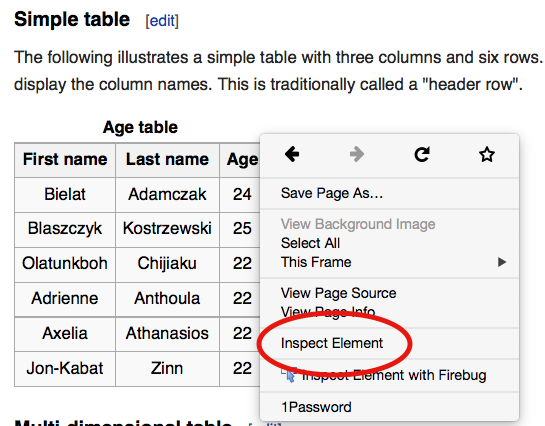
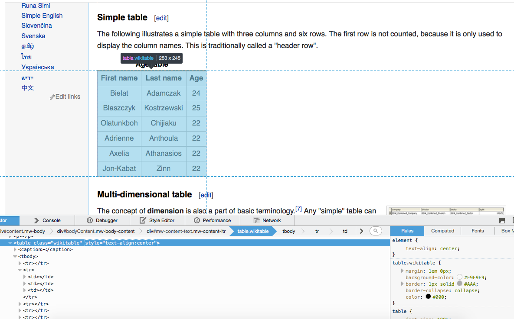
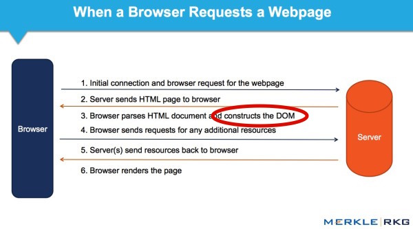
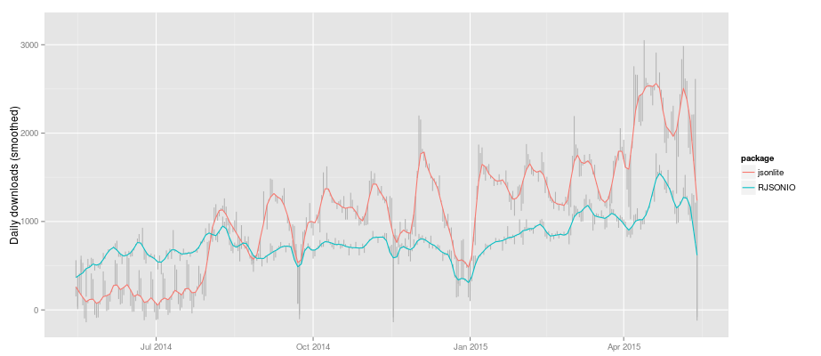

```{r setup, echo=FALSE, message=FALSE}
library(knitr)
opts_chunk$set(message = FALSE, cache = TRUE, warning = FALSE)
```

## Curiosity

<div align = "center">
 
</div>

## Leads to search

<div align = "center">
 
</div>

## Leads to discovery!

<div align = "center">
 
</div>

## Leads to trapped data?

<div align = "center">
 
</div>

## Leads to quitting?

<div align = "center">
 
</div>

## A web of data

> - In 2008, [an estimated](http://yz.mit.edu/papers/webtables-vldb08.pdf) __154 million HTML tables__ (out of the 14.1 billion) contain 'high quality relational data'!!!
> - Hard to quantify how much more exists outside of HTML Tables, but there is [an estimate](https://cs.uwaterloo.ca/~x4chu/SIGMOD2015_1.pdf) of __at least 30 million lists__ with 'high quality relational data'.
> - A growing number of websites/companies [provide programmatic access](http://www.programmableweb.com/category/all/apis?order=field_popularity) to their data/services via web APIs (that data typically comes in XML/JSON format).

## Before scraping, do some googling!

> - If the resource is well-known, someone else has probably built a tool which solves the problem for you.
> - I wrote [pitchRx](http://cran.r-project.org/web/packages/pitchRx/) which downloads, parses, cleans, and transforms XML data for a specific baseball data resource. Just give it start/end dates.
> - [ropensci](https://ropensci.org/) has a [ton of R packages](https://ropensci.org/packages/) providing easy-to-use interfaces to open data.
> - The [Web Technologies and Services CRAN Task View](http://cran.r-project.org/web/views/WebTechnologies.html) is a great overview of various tools for working with data that lives on the web in R.

## A web of _messy_ data!

> - In statistical modeling, we typically assume data is [tidy](http://vita.had.co.nz/papers/tidy-data.pdf).
> - That is, data appears in a tabular form where
    * 1 row == 1 observation
    * 1 column == 1 variable (observational attribute)
> - Parsing HTML/XML/JSON is easy; but putting it into a tidy form is typically _not easy_.
> - Knowing a bit about modern tools & web technologies makes it _much_ easier.

---

<div align = "center">
  
</div>

## Motivating Example

<iframe src = "http://en.wikipedia.org/wiki/Table_%28information%29" width = "800px" height = "600px"></iframe>


## Inspecting elements

<div align = "center">
 
</div>

## Hover to find desired elements

<div align = "center">
 
</div>

## Wikitable {.build}

```{r}
library(rvest)
src <- html("http://en.wikipedia.org/wiki/Table_(information)")
node <- html_node(src, css = ".wikitable")
```

> - `".wikitable"` is a CSS selector which says: "grab nodes (aka elements) with a class of wikitable".
> - `html_table()` converts a single `<table>` node to a data frame.

```{r}
html_table(node)
```

## Pipeable! {.build}

```{r}
html("http://en.wikipedia.org/wiki/Table_(information)") %>%
  html_node(".wikitable") %>% html_table()
```

> - Much easier to read/understand!

## Your Turn 1

Navigate [this page](http://www.wunderground.com/history/airport/KVAY/2015/2/17/DailyHistory.html?req_city=Cherry+Hill&req_state=NJ&req_statename=New+Jersey&reqdb.zip=08002&reqdb.magic=1&reqdb.wmo=99999&MR=1) and try the following:

__Easy__: Grab the table at the bottom of the page (hint: instead of grabbing a node by class with `html_node(".class")`, you can grab by id with `html_node("#id")`)

__Medium__: Grab the actual mean, max, and min temperature.

__Hard__: Grab the weather history graph and write the figure to disk (`download.file()` may be helpful here). 

[See here](https://gist.github.com/cpsievert/57be009120bb5298affa) for a solution (thanks Hadley Wickham for the example)

# What about non-`<table>` data?

## (selectorgadget + rvest) to the rescue!

> - [Selectorgadget](http://selectorgadget.com/) is a [Chrome browser extension](https://chrome.google.com/webstore/detail/selectorgadget/mhjhnkcfbdhnjickkkdbjoemdmbfginb?hl=en) for quickly extracting desired parts of an HTML page.
> - With some user feedback, the gadget find out the [CSS selector](http://www.w3.org/TR/2011/REC-css3-selectors-20110929/) that returns the highlighted page elements.
> - Let's try it out on [this page](http://www.sec.gov/litigation/suspensions.shtml)

## Extracting links to download reports {.build}

```{r}
domain <- "http://www.sec.gov"
susp <- paste0(domain, "/litigation/suspensions.shtml")
hrefs <- html(susp) %>% html_nodes("p+ table a") %>% html_attr(name = "href")
tail(hrefs)
```

```{r, eval = FALSE}
# download all the pdfs!
hrefs <- hrefs[!is.na(hrefs)]
pdfs <- paste0(domain, hrefs)
mapply(download.file, pdfs, basename(pdfs))
```

## Your Turn 2

Nativigate to Wikipedia's [list of data structures](http://en.wikipedia.org/wiki/List_of_data_structures) use SelectorGadget + rvest to do the following:

1. Obtain a list of Primitive types
2. Obtain a list of the different Array types

[See here](https://gist.github.com/cpsievert/c1b851ff5e1bd846de46) for a solution.

# Scraping _dynamic_ web pages

---

```{r}
# returns the HTML page source, which is _static_ (no table!)
rvest::html("http://bl.ocks.org/cpsievert/raw/2a9fb8f504cd56e9e8e3/")
```

## Browser <-> Web Server

<div align = "center">
 
</div>

---

[rdom](https://github.com/cpsievert/rdom) can construct the DOM:

```{r, eval = FALSE}
library(rdom)
rdom("http://bl.ocks.org/cpsievert/raw/2a9fb8f504cd56e9e8e3/") %>%
  html_node("table") %>% html_table()
```

```
    X1   X2   X3
1 Cell Cell Cell
2 Cell Cell Cell
3 Cell Cell Cell
```

You can give `rdom()` CSS Selectors directly to avoid sending the _entire_ DOM from phantomjs to R

```{r, eval = FALSE}
rdom("http://www.techstars.com/companies/stats/", "table") %>%
  html_table()
```

```
    X1   X2   X3
1 Cell Cell Cell
2 Cell Cell Cell
3 Cell Cell Cell
```

## Don't abuse your power

> - If you scrape a website, please read the terms and conditions!!
> - For [client-side dynamic sites](https://en.wikipedia.org/wiki/Dynamic_web_page#Client-side_scripting), it's sometimes more efficient/appropriate to [find the API](http://www.gregreda.com/2015/02/15/web-scraping-finding-the-api/) rather than rendering the entire DOM.
> - If a website public offers an API, USE IT (instead of scraping)!!!

## Web APIs {.build} 

> - [Server-side Web APIs](https://en.wikipedia.org/wiki/Web_API#Server-side) are a popular way to provide easy access to data and other services. 
> - If you (the client) want data from a server, you typically need one HTTP verb -- `GET`.

```{r}
library(httr)
hadley <- GET("https://api.github.com/users/hadley")
content(hadley)[c("name", "company")]
```

> - Other HTTP verbs -- `POST`, `PUT`, `DELETE`, etc...
    * You probably won't need these unless your developing a web app.

## Request/response model {.build}

> - When you (the client) _requests_ a resource from the server. The server _responds_ with a bunch of additional information.

```{r}
hadley <- httr::GET("https://api.github.com/users/hadley")
hadley$header[1:3]
```

> - Nowadays content-type is usually XML or JSON (HTML is great for _sharing content_ between _people_, but it isn't great for _exchanging data_ between _machines_.)

## What is XML?

XML is a markup language that looks very similar to HTML.

```xml
<mariokart>
  <driver name="Bowser" occupation="Koopa">
    <vehicle speed="55" weight="25"> Wario Bike </vehicle>
    <vehicle speed="40" weight="67"> Piranha Prowler </vehicle>
  </driver>
  <driver name="Peach" occupation="Princess">
    <vehicle speed="54" weight="29"> Royal Racer </vehicle>
    <vehicle speed="50" weight="34"> Wild Wing </vehicle>
  </driver>
</mariokart>
```

> - This example shows that XML can (and is) used to store inherently tabular data ([thanks Jeroen Ooms for the fun example](http://arxiv.org/pdf/1403.2805v1.pdf))
> - What is are the observational units here? How many observations in total?
> - Two units and 6 total observations (4 vehicles and 2 drivers).

## XML2R {.build}

[XML2R](https://github.com/cpsievert/XML2R) is a framework to simplify acquistion of tabular/relational XML.

```{r, eval = FALSE}
library(XML2R)
obs <- XML2Obs("http://bit.ly/mario-xml")
table(names(obs))
```

```{r, echo = FALSE}
# hopefully no one is watching
library(XML2R)
obs <- XML2Obs("http://bit.ly/mario-xml", quiet = TRUE)
table(names(obs))
```

* The main idea of __XML2R__ is to coerce XML into a _flat_ list of observations.
* The list names track the "observational unit".
* The list values track the "observational attributes".

---

```{r}
obs # named list of observations
```

---

```{r}
collapse_obs(obs) # group into table(s) by observational name/unit
```

> - What information have I lost?
> - I can't map vehicles to the drivers!

---

```{r}
obs <- add_key(obs, parent = "mariokart//driver", recycle = "name")
collapse_obs(obs)
```

---

Now (if I want) I can merge the tables into a single table...

```{r}
tabs <- collapse_obs(obs)
merge(tabs[[1]], tabs[[2]], by = "name")
```

## What about JSON? {.build}

> - JSON is quickly becoming _the_ format for data on the web.
> - JavaScript Object Notation (JSON) is comprised of two components:
    * arrays => [value1, value2]
    * objects => {"key1": value1, "key2": [value2, value3]} 
> - The preferred R package for R <=> JSON conversion has long been [RJSONIO](http://cran.r-project.org/web/packages/RJSONIO/index.html)
> - However, [jsonlite](http://cran.r-project.org/web/packages/jsonlite/index.html) is gaining a lot of momentum/attention.
> - In fact, [shiny will soon be moving from RJSONIO to jsonlite](https://github.com/rstudio/shiny/issues/572).

## Package downloads from RStudio's CRAN mirror

<div align="center">
  
</div>

## Back to Mariokart {.smaller}

```json
[
    {
        "driver": "Bowser",
        "occupation": "Koopa",
        "vehicles": [
            {
                "model": "Wario Bike",
                "speed": 55,
                "weight": 25
            },
            {
                "model": "Piranha Prowler",
                "speed": 40,
                "weight": 67
            }
        ]
    },
    {
        "driver": "Peach",
        "occupation": "Princess",
        "vehicles": [
            {
                "model": "Royal Racer",
                "speed": 54,
                "weight": 29
            },
            {
                "model": "Wild Wing",
                "speed": 50,
                "weight": 34
            }
        ]
    }
]
```


---

```{r}
library(jsonlite)
mario <- fromJSON("http://bit.ly/mario-json")
str(mario) # nested data.frames?!? 
```

---

```{r}
mario$driver
mario$vehicles
```

How do we get two tables (with a common id) like the XML example?

---

```{r}
# this mapply statement is essentially equivalent to add_key
vehicles <- mapply(function(x, y) cbind(x, driver = y), 
                   mario$vehicles, mario$driver, SIMPLIFY = FALSE)
Reduce(rbind, vehicles)
mario[!grepl("vehicle", names(mario))]
```

